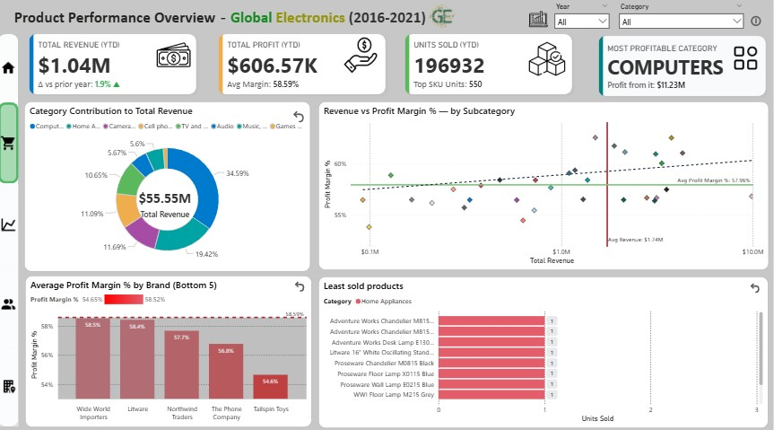
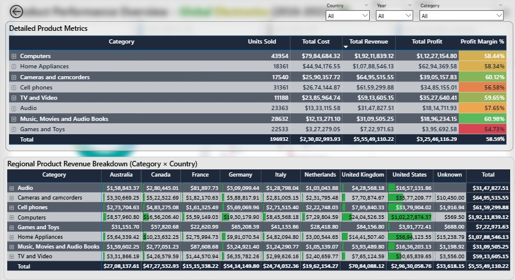

# 📊 Global Electronics: Retail Sales Operations Dashboard

> *A complete end-to-end retail analytics project built using SQL and Power BI, focused on uncovering performance trends, product profitability, and customer retention insights.*

---

<h1>
  $${\color{green}Global \space \color{yellow}Electronics}$$
</h1>
<h3>Retail Sales Operations Dashboard</h3>

### 1. Client Background & Project Context

Global Electronics is a (fictional) multinational retailer specializing in high-end consumer electronics. Founded in 2010, the company expanded rapidly from its North American roots, establishing a significant physical presence across Europe and Australia with over 70 stores, complemented by a robust e-commerce ("Online") platform.

For years, GE was a market leader, but following a record-breaking year in 2019, the company began to see a significant and worrying decline in sales. Leadership was unable to diagnose the root cause: was this a market-wide (e.g., pandemic) problem, a failure in customer retention, a shift in product demand, or regional underperformance?

The primary stakeholders—the **VP of Sales** and the **Director of Marketing**—initiated this project to transform 5+ years (2016-2021) of raw, messy, and siloed transactional data into a unified, reliable, and actionable analytics dashboard to guide their recovery strategy.

---

### 2. Business Problem & Objective

The core business problem was a **lack of visibility**. The leadership team was "flying blind" and could not answer critical, data-driven questions:

* **Why** did our strong sales growth reverse after 2019?
* **Are** we failing to acquire new customers, or are we losing our loyal ones?
* **Which** products and categories are our true profit drivers, and which are "cash cows" (high revenue, low margin)?
* **Where** are our most (and least) efficient stores and regions?

The **objective** of this project was to clean, model, and analyze five years of data (from 5 tables: `Sales`, `Products`, `Customers`, `Stores`, `Exchange Rates`) to build a "single source of truth" dashboard. This tool would diagnose the root causes of the sales decline and identify the most valuable opportunities for growth.

---

### 3. North-Star Metrics (Key Business Goals)

To provide actionable answers, the analysis was focused on a set of "North-Star" KPIs that measure the complete health of the business:

* **`Total Revenue & YoY Growth`**: To measure top-line performance.
* **`Total Profit & Profit Margin %`**: To measure bottom-line efficiency.
* **`New Customer Acquisition (YTD)`**: To measure market expansion.
* **`Customer Retention (Recency)`**: To measure customer loyalty and churn.
* **`Customer Lifetime Value (CLV)`**: To measure the long-term value of a customer.
* **`Average Order Value (AOV)`**: To measure the average basket size.
* **`Sales per Square Meter`**: To measure the efficiency of physical stores.

---

## 📈 4. Executive Summary

> *A holistic overview of Global Electronics’ performance between 2016–2021, revealing a steep post-2019 decline in revenue and profitability, with retention challenges across key customer segments.*

---

### 🧭 Executive Dashboard Overview

**Purpose:**  
This dashboard consolidates company-wide performance metrics into a single, interactive view — combining sales trends, profitability, customer segmentation, and product insights.

**Key Components**
- **5 KPI cards** tracking YTD revenue, profit, AOV, CLV, and growth.  
- **Global sales distribution** by continent.  
- **Revenue & profit trendline** across six years.  
- **Product and customer segment overviews.**  
- **Strategic recommendations** for decision-makers.

---

### 💼 KPI Snapshot — *2020 vs Prior Year*

| KPI | 2020 | Δ vs 2019 |   Interpretation |
|------|------:|-----------:|:---------------|
| **Total Revenue (YTD)** | \$9.24M | 🔻 -49.2% | Demand contraction post-2019 peak |
| **Total Profit (YTD)** | \$5.42M | 🔻 -49.2% | Margin pressure across categories |
| **Average Order Value (AOV)** | \$2.00K | 🔻 -0.40% | Remained resilient despite sales decline |
| **Customer Lifetime Value (CLV)** | \$2.40K | 🔻 -49.2% | Customer loyalty erosion |
| **Revenue Growth (local)** | -49.23% |🔻 -0.00% | Minimal Currency impact |

📉 **Insight:**  
While overall revenue and profit nearly halved in 2020, average order value remained stable, suggesting that customer purchasing power or product pricing held steady.

💡 **Implication:**  
The decline was volume-driven, not price-driven — indicating lost customers rather than lower spend per transaction. Recovery efforts should therefore focus on retention and reactivation, not discounting.

---

### 📊 Growth Trend — *Revenue Peaked in 2019*

📈 **Insight:**  
Between 2016–2019, Global Electronics achieved consistent revenue growth, peaking at **\$5.7M** in Q4 2019.  
However, revenue fell sharply by **60% over the next two years**, with average quarterly revenue dropping from **\$2.6M → \$1.0M**.

💡 **Implication:**  
The business was overly reliant on volume-driven sales and lacked resilience in repeat purchases, exposing vulnerabilities when external shocks hit.

---

### 🧩 Product and Customer Revenue Drivers

📈 **Insight:**  
- **Computers** and **Home Appliances** generated **>60% of total profit**.  
- The **65+ age group** alone contributed **~50% of total revenue**, while younger cohorts (18-35) were underrepresented.

💡 **Implication:**  
Dependence on a narrow product mix and aging demographic poses long-term growth risks — diversification is essential.

---

### 👥 Customer Lifecycle Overview

📈 **Insight:**  
Of the **15K customers**,  
- **60.6%** are **Dormant** (no purchase in the last 12 months),
- **12.1%** are **At-Risk** (declining frequency, low engagement),
- **22.2%** are **Unacquired** (potential new market),  
- only **5%** remain **Active** (generating the majority of current revenue).

💡 **Implication:**  
Reactivating At-Risk and Dormant customers presents the fastest path to revenue recovery.
Short-term focus should include:
- **Personalized win-back email** campaigns targeting the At-Risk group
- **Loyalty incentives** (e.g., tiered rewards) for Active customers to prevent churn
- Using predictive churn models to identify early warning signals in repeat purchase behavior

---

### 🧭 Strategic Summary

| Focus Area | Key Takeaway | Business Action |
|-------------|--------------|-----------------|
| **Sales Trend** | Growth momentum collapsed post-2019 | Stabilize revenue base via customer retention |
| **Product Mix** | Profit concentrated in few categories | Diversify portfolio into mid-margin products |
| **Customer Base** | Aging, dormant customer segments | Launch reactivation & loyalty initiatives |
| **Geographic Focus** | North America = 60% of profit | Expand Europe; localize offers in APAC |

---

## 🧹 5. Data Cleaning Summary

> *Before analysis, over 5 years of raw data (2016–2021) from five independent CSV files were audited, cleaned, and standardized in SQL.  
This process transformed the dataset from inconsistent and unreliable into a **99.6% geo-validated, analytics-ready model**.*

---

### 🧭 Why SQL Instead of Excel?

The Sales table alone contained **60,000+ rows**, and joining multiple tables in Excel led to slow processing and inconsistent transformations.  
To ensure reproducibility and performance:

- A **SQLite database** was created  
- All raw CSVs were imported into SQL  
- Cleaning, validation, and reconstruction of each table was done using structured queries  
- The cleaned outputs were exported to Power BI for modeling

All SQL scripts are available in:  
📁 [`/Data_Cleaning_SQL`](Data_Cleaning_SQL/)

---

### 📄 Page 1 — Data Quality Overview

#### 🔍 Key Insights

- **461 invalid sales rows removed**, including duplicates, missing keys, impossible dates, and outliers.  
- **100% clean City → State → Country mappings** achieved using SQL lookup tables.  
- **19.54% duplicate keys** initially existed in the Sales table; all duplicates were flagged and resolved.  
- **32k+ inconsistent date values** standardized from mixed formats (`DD-MM-YYYY`, `MM/DD/YYYY`, text dates).  
- The **Sales and Customers tables accounted for over 70%** of all detected data issues.  
- Primary error categories: invalid geography, impossible dates, duplicate rows, and product-key mismatches.

---

### 🌍 Page 2 — Geographic Data Quality & Validation

#### 🔍 Key Insights

- Early validation identified **255+ geographic mismatches** across 5 countries.  
- After standardization, the dataset reached **100% state–country consistency**.  
- **76.32%** of all detected issues were **correctable**, minimizing data loss.  
- **Ambiguous or corrupted date formats** were documented and isolated as a final limitation.  
- Cleaned and validated tables were exported into Power BI for modeling.

---

### 📊 Cleaning Impact Summary

| Cleaning Metric | Result |
|-----------------|--------|
| Invalid Sales Removed | **461 records** |
| Geographic Mappings Corrected | **100% clean** (state → country) |
| Duplicate Keys Flagged | **19.54% of Sales**, **3.25% of Products** |
| Dates Standardized | **32,054 → 91,993** usable date values |
| Data Reliability Score | **99.6%** |

---

### 🧱 Final Output — Clean Data Model (Star Schema)

The cleaned SQL tables were transformed into a **Power BI star schema**:

- **FactSales** (central fact table)  
- **DimProducts**, **DimCustomers**, **DimStores**, **DimExchangeRates**  
- Optimized for DAX performance, filtering, and drilldowns

Model notes:  
📁 [`/Data_Model/Sales_Operations/readme.md`](/Data_Model/Sales_Operations/readme.md)

---

### 📘 Technical Appendix

<strong>SQL Scripts, DAX Measures, and Cleaning Tables</strong>

- SQL Cleaning Scripts → [`/Data_Cleaning_SQL`](Data_Cleaning_SQL/)  
- DAX Measures & Calculated Columns → [`/DAX`](DAX/)  
- Data Audit Tables (Excel) → [`/Data_Cleaning_Tables`](Data_Cleaning_Tables/)  

---

# 📘 6. Analytical Insights & Business Narrative

With the data now cleaned, validated, and modeled into a reliable star schema, the next section focuses on extracting **business-ready insights**.  
Each dashboard has been designed to answer a specific strategic question faced by Global Electronics, moving from product health to customer behavior and regional performance.

The analysis is structured into four “Acts,” each representing a pillar of the business:

---

## 📑 Analysis Table of Contents

- **Act 1: Product Performance Overview**  
  How categories, brands, and SKUs contribute to revenue, profit, and margin.  
- **Act 2: Sales Trends & Time Performance**  
  How revenue, profit, orders, and seasonality evolved across 2016–2021.  
- **Act 3: Customer Insights & Retention**  
  How different customer segments behave across value, recency, and cohorts.  
- **Act 4: Regional & Store Performance**  
  Which regions and stores drive growth, efficiency, and margin.

---

# 🟦 Act 1: Product Performance Overview

Global Electronics needed clarity on which product lines truly drive the business, which ones silently drain margin, and where SKU-level inefficiencies are concentrated. This analysis breaks down category contribution, brand profitability, and SKU movement to reveal the underlying product dynamics.

---

### 📸 Dashboard Overview (Primary View)

  

### **Key Insights**

1. **Category Revenue (Top 5 Pie Chart):**  
   The top 5 categories contribute **\$48.57M out of \$55.55M** total revenue (~87%).  
   Within this top-5 slice, **Computers + Home Appliances account for >60%**, showing severe over-concentration.

2. **Category Revenue (All Categories – Flip View):**  
   When looking at the full category distribution, the top two categories still hold **~54%** of total revenue.  
   Even smaller categories show minimal movement, highlighting an unbalanced product mix.

3. **Brand Profitability (Top 5):**  
   Among the highest-margin brands, margins are consistently above the portfolio average, proving strong pricing power in a small cluster of brands.

4. **Brand Profitability (Bottom 5):**  
   Bottom-performing brands show **significantly lower margins**, even when unit movement is reasonable—indicating supplier contract or cost issues.

5. **KPI Cards:**  
   - **Profit Margin is healthy** but heavily skewed toward a few categories and brands.  
   - **Units Sold (YTD)** shows a sharp drop outside top categories, exposing weak depth in the catalog.

### **Action Items**

1. **Reduce dependency** on Computers and Home Appliances. Build volume in 3–4 mid-tier categories (Audio, Phones, Cameras).  
2. **Re-negotiate vendor contracts** for low-margin brands. If improvement isn’t possible, reduce shelf exposure.  
3. **Introduce price optimization** for underperforming high-volume subcategories.  
4. **Expand margin-positive brands** with targeted promotions and preferred placement.  

---

## 📸 Dashboard Overview (Alternate View – All Categories + Brand Margin Flip)

  

### **Key Insights**

1. **All Categories Pie Chart:**  
   The category mix is top-heavy. Four categories combined contribute **nearly 75%** of revenue, leaving a small long-tail.

2. **Bottom 5 Brands (Margin Flip):**  
   These brands drag overall profitability and fail to meet even the portfolio’s median margin.

3. **Top 5 Brands:**  
   High-performing brands demonstrate stable margin consistency and lower volatility over months.

4. **KPI Cards:**  
   Category margin variability indicates **pricing and cost inconsistencies**, especially in mixed subcategories.

### **Action Items**

1. **Cut back on bottom-tier brands** or move them to a limited availability model.  
2. **Increase visibility for top brands** with store displays, ads, or bundling.  
3. **Rebalance supply chain costs** for categories showing high revenue but low realized profit.  

---

### 📸 Dashboard Overview (Detailed Metrics & Regional Breakdown)

  

### **Key Insights**

1. **Top 8 Products (Bar Chart):**  
   A small set of SKUs dominates unit movement, driving the majority of product-level revenue.

2. **Least Selling Products:**  
   A long tail of products shows **extremely low rotation**, tying up inventory and shelf space.

3. **Revenue vs Margin Scatter (Subcategories):**  
   Several subcategories appear in the **high-revenue but low-margin quadrant**—a classic sign of pricing inefficiency.

4. **Regional Category Breakdown (Matrix):**  
   Some categories that look strong globally underperform drastically in certain regions due to logistics cost and price sensitivity.

5. **Detailed Product Metrics Matrix:**  
   Margin variation between products within the same subcategory suggests differences in cost structure and discount patterns.

### **Action Items**

1. **Retire or bundle low-rotation SKUs** to increase inventory turnover.  
2. **Introduce regional pricing** where margin gaps appear due to cost/price mismatch.  
3. **Boost promotional focus** on high-performing SKUs to capitalize on natural demand.  
4. **Review discounting strategy** within subcategories showing volatile margin behavior.  

---

### 📝 Summary

The product portfolio is heavily reliant on a small number of strong categories and SKUs. While top sellers perform exceptionally, mid-tier categories remain under-developed and the long tail of low-rotation products weakens inventory efficiency. Margin leakage is persistent across bottom-tier brands and high-volume subcategories. A more balanced product strategy requires diversifying demand, optimizing brand-level profitability, addressing regional pricing gaps, and rationalizing slow-moving SKUs.

---
