# 📊 Global Electronics: Retail Sales Operations Dashboard

> *In this end-to-end retail analytics project, I simulated the role of a Lead BI Consultant to diagnose a 60% revenue decline. I designed the entire workflow—from writing custom SQL scripts for data cleaning to architecting the Power BI star schema and formulating the final strategic recovery roadmap.*

---

<div align="center">


</div>

---

## ⚡ Executive Snapshot

**The Problem**

After peaking in 2019, the business experienced a sharp revenue **decline of ~60% by 2021**. Despite stable pricing and margins, overall performance deteriorated, raising concerns about **demand sustainability, geographic exposure, and customer health**.

**The Diagnosis**
- **It is a Volume Crisis, not a Margin Crisis**: The revenue decline is volume-driven, not margin-driven. Profit margins remained consistently stable (~58–59%) across products, regions, and stores, indicating strong cost control.
- **The "Silent" Churn**: The customer base is structurally weak, **with over 60% of customers dormant and only ~5% actively contributing to current revenue**.
- **Structural Imbalance**: **Revenue is highly concentrated** in a narrow set of product categories (Computers, Home Appliances) and regions (North America, Western Europe), increasing risk exposure.
- **Australia consistently underperforms**:  The Australian region is not doing well across revenue, growth, and store efficiency metrics, pointing to structural or market-specific issues rather than short-term volatility.

**The Solution**
- **Immediate Reactivation**: The fastest and highest-impact recovery lever is **customer reactivation and retention, not discounting or margin optimization**. Launch targeted win-back campaigns for the 60% dormant user base
- **Replicate playbooks**: Growth should prioritize **scaling proven high-margin categories** and replicating execution playbooks from top-performing stores and regions.
- **Defend the Core**: Underperforming geographies such as Australia require **targeted intervention or strategic reassessment**, while core regions should be defended and optimized.

This project consolidates five years of fragmented retail data into a single decision system to identify decline drivers and guide recovery strategy.

**💨 How to Read This Project (2 minutes)**

 - If you’re short on time: read Executive Snapshot + Act Summaries

 - If you want depth: jump to any Act using the navigation table

 - Dashboards are designed for interactive exploration, screenshots are for context

---

# 1. Client Background & Project Context

Global Electronics is a (fictional) multinational retailer specializing in high-end consumer electronics. Founded in 2010, the company expanded rapidly from its North American roots, establishing a significant physical presence across Europe and Australia with over 70 stores, complemented by a robust e-commerce ("Online") platform.

For years, GE was a market leader, but following a record-breaking year in 2019, the company began to see a significant and worrying decline in sales. Leadership was unable to diagnose the root cause: was this a market-wide (e.g., pandemic) problem, a failure in customer retention, a shift in product demand, or regional underperformance?

The primary stakeholders—the **VP of Sales** and the **Director of Marketing**—initiated this project to transform 5+ years (2016-2021) of raw, messy, and siloed transactional data into a unified, reliable, and actionable analytics dashboard to guide their recovery strategy.

---

---

# 2. Business Problem & Objective

The core business problem was a **lack of visibility**. The leadership team lacked an integrated view across products, customers, regions, and time and could not answer critical, data-driven questions:

* **Why** did our strong sales growth reverse after 2019?
* **Are** we failing to acquire new customers, or are we losing our loyal ones?
* **Which** products and categories are our true profit drivers, and which are "cash cows" (high revenue, low margin)?
* **Where** are our most (and least) efficient stores and regions?

My primary objective was to transform 5 years of fragmented raw data into a reliable decision-making system. I structured the analysis to specifically answer leadership's doubts about the 2021 decline, ensuring that every dashboard I built directly addressed a strategic question regarding profit, retention, or efficiency.

---

---

# 3. North-Star Metrics (Key Business Goals)

To provide actionable answers, the analysis was focused on a set of "North-Star" KPIs that measure the complete health of the business:

* **`Total Revenue & YoY Growth`**: To measure top-line performance.
* **`Total Profit & Profit Margin %`**: To measure bottom-line efficiency.
* **`New Customer Acquisition (YTD)`**: To measure market expansion.
* **`Customer Retention (Recency)`**: To measure customer loyalty and churn.
* **`Customer Lifetime Value (CLV)`**: To measure the long-term value of a customer.
* **`Average Order Value (AOV)`**: To measure the average basket size.
* **`Sales per Square Meter`**: To measure the efficiency of physical stores.

---

---

# 📈 4. Executive Summary

> *A holistic overview of Global Electronics’ performance between 2016–2021, revealing a steep post-2019 decline in revenue and profitability, with retention challenges across key customer segments.*

---

### 🧭 Executive Dashboard Overview

<div align="center">

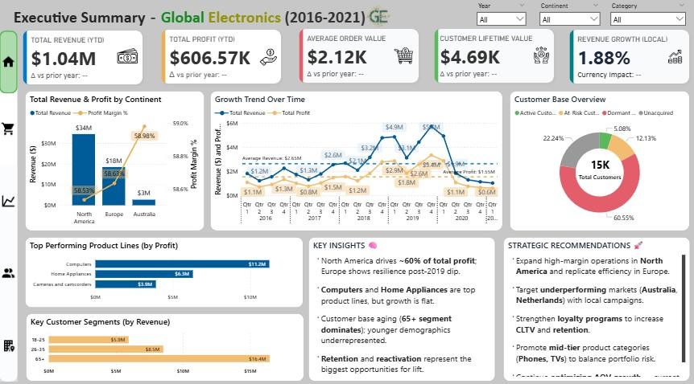

</div>

**Purpose:**  
This dashboard consolidates company-wide performance metrics into a single, interactive view — combining sales trends, profitability, customer segmentation, and product insights.

**Key Components**
- **5 KPI cards** tracking YTD revenue, profit, AOV, CLV, and growth.  
- **Global sales distribution** by continent.  
- **Revenue & profit trendline** across six years.  
- **Product and customer segment overviews.**  
- **Strategic recommendations** for decision-makers.

---

### 💼 KPI Snapshot — *2020 vs Prior Year*

<div align="center">

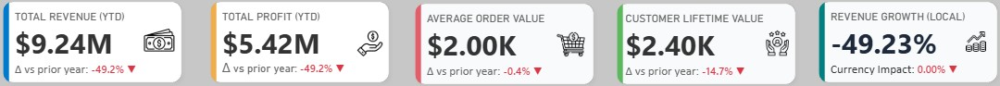

</div>

| KPI | 2020 | Δ vs 2019 |   Interpretation |
|------|------:|-----------:|:---------------|
| **Total Revenue (YTD)** | \$9.24M | 🔻 -49.2% | Demand contraction post-2019 peak |
| **Total Profit (YTD)** | \$5.42M | 🔻 -49.2% | Margin pressure across categories |
| **Average Order Value (AOV)** | \$2.00K | 🔻 -0.40% | Remained resilient despite sales decline |
| **Customer Lifetime Value (CLV)** | \$2.40K | 🔻 -14.7% | Customer loyalty erosion |
| **Revenue Growth (local)** | -49.23% |🔻 -0.00% | Minimal Currency impact |

📉 **Insight:**  
While overall revenue and profit nearly halved in 2020, average order value remained stable, suggesting that customer purchasing power or product pricing held steady.

💡 **Implication:**  
The decline was volume-driven, not price-driven — indicating lost customers rather than lower spend per transaction. Recovery efforts should therefore focus on retention and reactivation, not discounting.

---

### 📊 Growth Trend — *Revenue Peaked in 2019*

<div align="center">


</div>

📈 **Insight:**  
Between 2016–2019, Global Electronics achieved consistent revenue growth, peaking at **\$5.7M** in Q4 2019.  
However, revenue fell sharply by **60% over the next two years**, with average quarterly revenue dropping from **\$2.6M → \$1.0M**.

💡 **Implication:**  
The business was overly reliant on volume-driven sales and lacked resilience in repeat purchases, exposing vulnerabilities when external shocks hit.

---

### 🧩 Product and Customer Revenue Drivers

<div align="center">

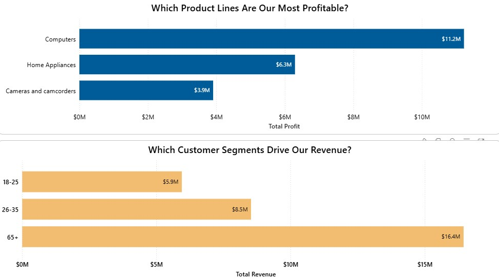

</div>

📈 **Insight:**  
- **Computers** and **Home Appliances** generated **>60% of total profit**.  
- The **65+ age group** alone contributed **~50% of total revenue**, while younger cohorts (18-35) were underrepresented.

💡 **Implication:**  
Dependence on a narrow product mix and aging demographic poses long-term growth risks — diversification is essential.

---

### 👥 Customer Lifecycle Overview

<div align="center">


</div>

📈 **Insight:**  
Of the **15K customers**,  
- **60.6%** are **Dormant** (no purchase in the last 12 months),
- **12.1%** are **At-Risk** (declining frequency, low engagement),
- **22.2%** are **Unacquired** (potential new market),  
- only **5%** remain **Active** (generating the majority of current revenue).

💡 **Implication:**  
Reactivating At-Risk and Dormant customers presents the fastest path to revenue recovery.
Short-term focus should include:
- **Personalized win-back email** campaigns targeting the At-Risk group
- **Loyalty incentives** (e.g., tiered rewards) for Active customers to prevent churn
- Using predictive churn models to identify early warning signals in repeat purchase behavior

---

### 🧭 Strategic Summary

| Focus Area | Key Takeaway | Business Action |
|-------------|--------------|-----------------|
| **Sales Trend** | Growth momentum collapsed post-2019 | Stabilize revenue base via customer retention |
| **Product Mix** | Profit concentrated in few categories | Diversify portfolio into mid-margin products |
| **Customer Base** | Aging, dormant customer segments | Launch reactivation & loyalty initiatives |
| **Geographic Focus** | North America = 60% of profit | Expand Europe; localize offers in APAC |

---

---

# 📘 5. Analytical Insights & Business Narrative

With the data cleaned, validated, and modeled into a reliable star schema, the next section focuses on extracting **business-ready insights**.  
Each dashboard has been designed to answer a specific strategic question faced by Global Electronics, moving from product health to customer behavior and regional performance.

To make the insights digestible for non-technical stakeholders, I designed the narrative around four "Acts." Instead of a generic report, I curated each dashboard to tell a specific part of the story—moving from the product portfolio health in Act 1 to the regional efficiency gaps in Act 4.

---

# 📚 Global Navigation Table

Use this table to jump across all dashboards, KPIs, analyses, and summaries in the project.  
The structure mirrors the four core business pillars of the Global Electronics narrative.

---

## 🟪 Act 1 — Product Performance & Portfolio Diagnosis
  
  How categories, brands, and SKUs contribute to revenue, profit, and margin. 

| Section | Description | Link |
|--------|-------------|------|
| **KPI Summary** | Product-level revenue, profit, units, and category profitability | [Jump to KPI Summary](#-kpi-summary) |
| **A. Category Revenue Contribution** | Top vs long-tail categories and portfolio concentration | [View Section](#a-category-revenue-contribution-pie-charts) |
| **B. Profit Margin Distribution by Brand** | Margin stability and risk analysis | [View Section](#b-profit-margin-distribution-by-brand-top-5--bottom-5) |
| **C. Subcategory BCG Matrix** | Stars, Cash Cows, Question Marks, Dogs | [View Section](#c-subcategory-positioning--revenue-vs-profit-margin-bcg-quadrant) |
| **D. SKU-Level Performance** | Best and worst performing SKUs | [View Section](#d-sku-level-performance--top-vs-least-selling-products) |
| **E. Product Metrics Matrix** | Revenue, units, margins by category | [View Section](#e-detailed-metrics--regional-product-performance) |
| **Act Summary** | Portfolio strengths, weaknesses and optimisation actions | [Jump](#-act-1-summary) |

---
  
## 🟦 Act 2 — Sales Performance Over Time

  How revenue, profit, orders, and seasonality evolved across 2016–2021.  

| Section | Description | Link |
|--------|-------------|------|
| **KPI Summary** | Volume, revenue, margin and delivery metrics for YTD | [Jump to KPI Summary](#-kpi-summary-1) |
| **A. Revenue, Profit & Margin (RPM)** | Multi-year operating trajectory | [View Section](#a-revenue-profit--margin-over-time) |
| **B. YoY Revenue Growth %** | Expansion and contraction phases | [View Section](#b-year-over-year-revenue-growth-) |
| **C. Orders & Delivery Speed** | Demand vs operational efficiency | [View Section](#c-order-volume--delivery-speed-over-time) |
| **D. Operational Health (AOV, Orders, Margin)** | Core economics health check | [View Section](#d-operational-health-trends-orders-aov-margin) |
| **E. Cumulative Sales Progress** | Year-by-year sales trajectory comparison | [View Section](#e-cumulative-sales-progress-by-year) |
| **F. Category Profit Contribution** | Long-term profitability by category | [View Section](#f-product-category-profit-contribution-over-time) |
| **G. Regional Profit Contribution** | Profitability by region over time | [View Section](#g-regional-profit-contribution-over-time) |
| **H. Monthly Sales Heatmap** | Seasonality and disruption patterns | [View Section](#h-monthly-sales-heatmap) |
| **Act Summary** | Peak-to-decline narrative and market signals | [Jump](#-act-2-summary) |

---
  
## 🟩 Act 3 — Customer Insights & Retention Analysis

  How different customer segments behave across value, recency, and cohorts.  

| Section | Description | Link |
|--------|-------------|------|
| **KPI Summary** | Active customers, AOV, CLTV, new customers | [Jump to KPI Summary](#-kpi-summary-2) |
| **A. Customer Demographics** | Age & gender distribution | [View Section](#-a-customer-demographics-by-age--gender) |
| **B. Revenue & Profit by Demographics** | Customer value drivers | [View Section](#-b-revenue--profit-by-age--gender) |
| **C. CLTV & AOV Analysis** | High-value customer segments | [View Section](#-c-cltv--aov-by-age-group--gender) |
| **D. Customer Value Decay** | Value deterioration by recency | [View Section](#-d-customer-value-decay-by-recency) |
| **E. Acquisition & Retention Trends** | New, active, and returning users | [View Section](#-e-customer-acquisition--retention-trends-20162021) |
| **F. Cohort Analysis** | Longitudinal retention | [View Section](#-f-customer-retention-cohort-analysis) |
| **G. RFM Segmentation** | Actionable retention clusters | [View Section](#-g-rfm-segmentation-recencyfrequencymonetary) |
| **Act Summary** | Retention gaps and next-step strategy | [Jump](#-act-3-summary) |

---
  
## 🟥 Act 4 — Regional & Store Performance

  Which regions and stores drive growth, efficiency, and margin.

| Section | Description | Link |
|--------|-------------|------|
| **KPI Summary** | Revenue, margin, sales per sqm, store performance | [Jump to KPI Summary](#-kpi-summary-3) |
| **A. Regional Revenue Map** | Revenue + YoY growth by geography | [View Section](#-a-regional-revenue-distribution-map) |
| **B. Country RPM** | Revenue, profit, margin across countries | [View Section](#-b-revenue-profit--margin-by-country) |
| **C. Regional Matrix** | Region-level comparison (CLTV, profit, store density) | [View Section](#-c-regional-performance-summary-matrix) |
| **D. Top 6 States** | Best performing states by revenue | [View Section](#%EF%B8%8F-d-top-6-states-by-revenue) |
| **E. Bottom 6 States** | Weakest revenue contributors | [View Section](#-e-bottom-6-states-by-revenue) |
| **F. Top Stores by Efficiency** | Best sales-per-sqm stores | [View Section](#-f-top-6-stores-by-sales-efficiency) |
| **G. Bottom Stores by Efficiency** | Underperforming stores by density | [View Section](#-g-bottom-6-stores-by-sales-efficiency) |
| **H. Store Profitability Matrix** | Revenue vs margin clustering | [View Section](#-h-store-profitability-matrix-revenue-vs-margin) |
| **Act Summary** | Regional strategy and store optimisation | [Jump](#-act-4-summary) |

---

---

# 🟪 **ACT 1 — Product Performance & Portfolio Diagnosis**

This section analyzes **what Global Electronics sells**, **which categories drive growth**, and **which product segments drain performance**. The goal is to understand portfolio strengths and weaknesses through a combination of **revenue concentration**, **margin distribution**, **SKU performance**, and **subcategory positioning**.

---

## 📸 **Product Dashboard — Full View**

> **🔎 Click a link below to view each full dashboard page:**

- **📄 Page 1:** [Open Image](Dashboard_Screenshots/03_Product_Dashboard/Product_Performance_1.png)
- **📄 Page 2:** [Open Image](Dashboard_Screenshots/03_Product_Dashboard/Product_Performance_2.png)
- **📄 Page 3:** [Open Image](Dashboard_Screenshots/03_Product_Dashboard/Product_Performance_3.jpg)

---

## 📌 **KPI Summary**

Below is a snapshot of the key product-level performance indicators that anchor the Product dashboard. These KPIs set the context before diving into category- and brand-level visuals.

<p align="center">
  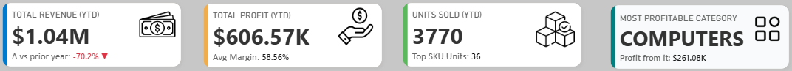
</p>

| **KPI** | **Value / Insight** | **Recommended Action** |
|--------|----------------------|--------------------------|
| **Total Revenue (YTD)** | **$1.04M**, **–70.2% vs PY**, reflecting severe contraction in 2021. | Address root causes of revenue collapse and rebuild category momentum. |
| **Total Profit (YTD)** | **$606.57K**, **58.56% margin**, margins remain stable despite revenue decline. | Maintain disciplined pricing, protect high-margin SKUs. |
| **Units Sold (YTD)** | **3,770 units**, sharp drop in volume. | Review category-level demand loss and reactivate best-selling SKUs. |
| **Top SKU Units (2021)** | **36 units**, dramatically lower than historical levels. | Investigate SKU visibility, pricing, and demand generation gaps. |
| **Most Profitable Category (2021)** | **Computers — $261.08K profit**. | Strengthen core category assortment and protect margin leaders. |

---

## **A. Category Revenue Contribution (Pie Charts)**


### ❓ **Business Question**  
**Which categories contribute the most to revenue, and how concentrated is the portfolio?**

---

### 📊 **Top 5 Categories vs All Categories**

<p align="center">
  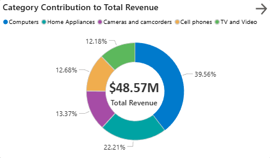
  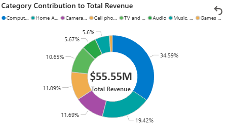
</p>

---

### ⭐ **Insights**

#### **1. Extreme Revenue Concentration**
- The **Top 5 categories generate \$48.57M**, accounting for **~87.5% of total revenue (\$55.55M)**.
- This reflects a **tightly concentrated portfolio** and strong reliance on a few key categories.

#### **2. “Computers” Is the Dominant Driver**
- Top 5 view: **Computers = 39.56%**  
- All Categories: **Computers = 34.59%**
- Slight decline in share after adding long-tail categories, but the category remains the unchallenged leader.

#### **3. Long-Tail Categories Matter Collectively**
- Audio, Games, Toys, Music, Movies, etc. contribute **\$6.98M (~12.5%)**.
- Individually small but collectively worth nurturing.

---

### 💡 **Action Items**

#### **1. Strengthen High-Performing Segments**
Focus forecasting, funding, and stock allocation on:
- **Computers**
- **Home Appliances**
- **Cameras & Camcorders**
- **Cell Phones**
- **TV & Video**

#### **2. Grow the Long Tail**
- Targeted digital ads for niche categories  
- Bundle low-volume items with Computers or Home Appliances  
- Adjust pricing/positioning for slow movers  

#### **3. Optimize Pricing & Assortment**
- Promote high-margin underdogs  
- Repackage poor performers  
- Retire unviable SKUs  

---

---

## **B. Profit Margin Distribution by Brand (Top 5 & Bottom 5)**


### ❓ **Business Question**  
**How consistent are margins across brands, and where do margin risks exist?**

---

#### 📊 **Brand Margin Charts**

<p align="center">
  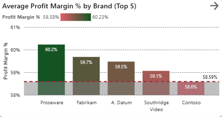
  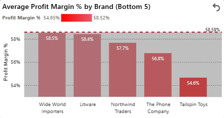
</p>

---

### ⭐ **Insights**

#### **1. Strong Margin Portfolio**
- Average margin: **58.59%**
- Even the weakest brand, **Tailspin Toys**, posts **54.6%**, which is very profitable for retail.

#### **2. Very Narrow Margin Spread**
- Range: **54.6% → 60.2%**  
- Indicates:
  - Stable pricing power  
  - Standardized cost efficiency  
  - Low performance risk  

#### **3. Top Performers Lead with Discipline**
- Proseware: **60.2%**  
- Fabrikam, A. Datum, Southridge Video also exceed average

#### **4. Bottom Performers Are Only Slightly Below Average**
- Brands like **Wide World Importers, Litware, Northwind Traders** remain close to average margins.

---

### 💡 **Action Items**

#### **1. Extract Best Practices from Leaders**
Study:
- Pricing strategies  
- Cost structures  
- Vendor terms  
- SKU mixes  

#### **2. Margin Lift for Laggards**
- Evaluate underperforming SKUs  
- Improve merchandising  
- Adjust pricing or packaging  

#### **3. Continuous Monitoring**
Track margins quarterly for trend shifts and early warnings.

---

---

## **C. Subcategory Positioning — Revenue vs Profit Margin (BCG Quadrant)**


### ❓ **Business Question**  
**Which subcategories are Stars, Cash Cows, Question Marks, and Dogs?**

---

<p align="center">
  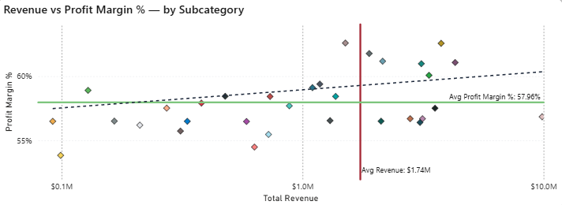
</p>

---

### ⭐ **Insights**

#### **⭐ Stars — High Revenue, High Margin**
- **Camcoders, Televisions, Projectors & Screens, Movie DVD**  
Backbone of the business.

#### **💰 Cash Cows — High Revenue, Moderate Margin**
- **Desktops, Water Heaters, Laptops, Touch Screen Phones**  
Volume-heavy but moderate margins.

#### **❓ Question Marks — High Margin, Low Revenue**
- **Coffee Machines, Microwaves, Cellphone Accessories**  
Great margins, limited scale.

#### **🐶 Dogs — Low Revenue, Low Margin**
- **Boxed Games, Fans, Home & Office Phones**  
Portfolio drag; low ROI.

---

## 💡 **Action Items**

#### **Invest Heavily in Stars**
- Expand lines  
- Stabilize supply chain  
- Drive marketing  

#### **Optimize Cash Cows**
- Improve efficiencies  
- Upsell warranties/accessories  

#### **Test & Scale Question Marks**
- Try campaigns  
- Bundle offerings  
- Pilot micro-expansion  

#### **Rationalize Dogs**
- Phase out weak SKUs  
- Sell via bundles  
- Switch to online-only distribution  

---

---

## **D. SKU-Level Performance — Top vs Least Selling Products**


### ❓ **Business Question**  
**Which SKUs are overperforming and which need urgent action?**

---

<p align="center">
  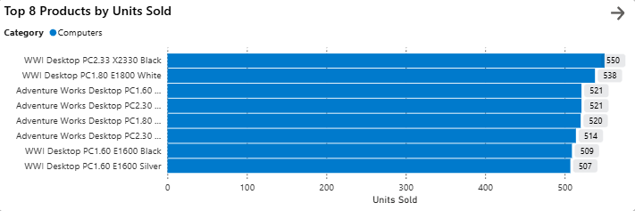
  
</p>

---

### ⭐ **Insights — Least Sold Products**

#### **1. Entire Bottom List is Home Appliances**
Lamps and chandeliers dominate the “least sold” list, indicating a systemic category issue.

#### **2. Extremely Low Traction**
Several SKUs sold **only one unit**, suggesting:
- Zero demand  
- Wrong pricing  
- Mismatched consumer taste  

#### **3. Likely Causes**
- Weak visibility online/in-store  
- Outdated designs  
- Uncompetitive pricing  
- Seasonal mismatch  

---

### ⭐ **Insights — Top Sold Products**

#### **1. Computers Completely Dominate**
All top 8 SKUs belong to desktop PCs.

#### **2. Strong Volume Consistency**
Sales range: **507 → 550 units** across brands/models.

#### **3. Clear Product-Market Fit**
The PC segment shows repeatable demand across variants.

---

### 💡 **Action Items**

#### **For Least Sellers**
- Re-evaluate product-market fit  
- Discount or bundle  
- Consider discontinuation  

#### **For Top Sellers**
- Prioritize inventory  
- Develop bundles (keyboards, monitors, protection plans)  
- Increase marketing exposure  

---

---

## **E. Detailed Metrics & Regional Product Performance**

### ❓ **Business Question**  
**Which categories and regions drive volume, revenue, and profit?**

---

<p align="center">
  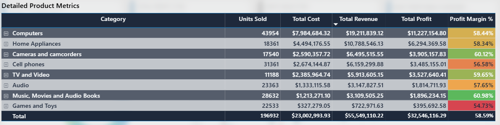
</p>

---

## ⭐ **Insights — Product Metrics Matrix**

#### **1. Revenue & Volume Powerhouses**
- **Computers**: 43,954 units, \$19.2M, 58.44% margin  
- **Home Appliances**: 18,361 units, \$10.8M

#### **2. High-Margin Hidden Gems**
- Cameras & Camcorders: **60.12%**  
- Music/Movies/Audiobooks: **60.98%**  
High margins but small-scale → expansion potential.

#### **3. Laggards Needing Review**
- Cell Phones: **56.58%**  
- Games & Toys: **54.73%**  
Increase focus on cost reduction and product mix optimization to improve margins.

---

<p align="center">
  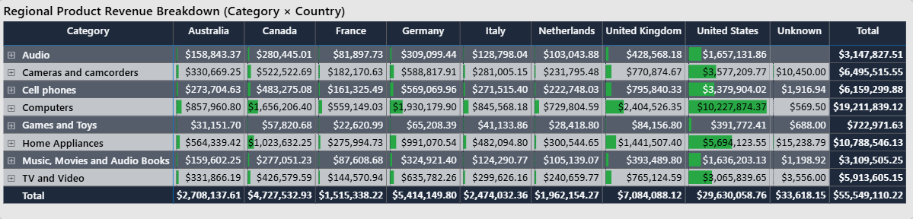
</p>

### ⭐ **Insights — Regional Product Matrix**

#### **1. U.S. Drives the Business**
Dominates in all the categories.

#### **2. UK, Germany & Canada Are Strong Secondary Markets**
Good performance across major categories.

#### **3. France, Italy, Netherlands Underperform**
Low revenue and weak category penetration.

---

### 💡 **Action Items**

#### **1. Scale Strength Markets**
- U.S., UK, Germany, Canada  
- Allocate inventory & promotions accordingly  

#### **2. Grow High-Margin Categories**
Push Cameras/Camcorders and Music/Audiobooks where local demand exists.

#### **3. Improve Weak Regions**
Conduct market research, adjust channels, run pilot campaigns.

---

## 🏁 **Act 1 Summary**

Global Electronics’ product portfolio shows strong revenue and margin concentration in Computers and Home Appliances, with these categories serving as core business drivers. While overall margin stability is maintained, performance across categories is mixed: some segments (like Cameras, Audio, Games, and Media) deliver lower volume or profit margins and require targeted intervention. In addition, underpenetrated regions and long-tail SKUs present clear opportunities for strategic portfolio optimization and international growth.

---

# 🟦 **ACT 2 — Sales Performance Over Time**

This section analyzes the **trajectory of Global Electronics’ business from 2016–2021**.  
We break down how revenue, profit, margin, order volume, delivery speed, category mix, and regional profit contributions evolved over time.  
This narrative exposes the true drivers behind GE’s rise to a 2019 peak and its sharp contraction afterward.

---

## 📸 **Sales Performance Dashboard — Full View**

> **🔎 Click a link below to view each full dashboard page:**

- **📄 Page 1:** [Open Image](Dashboard_Screenshots/04_Time_Dashboard/Time_Trends_1.jpg)
- **📄 Page 2:** [Open Image](Dashboard_Screenshots/04_Time_Dashboard/Time_Trends_2.jpg)
- **📄 Page 3:** [Open Image](Dashboard_Screenshots/04_Time_Dashboard/Time_Trends_3.jpg)
- **📄 Page 4:** [Open Image](Dashboard_Screenshots/04_Time_Dashboard/Time_Trends_4.jpg)

---

## 📌 **KPI Summary**

These operational KPIs provide a top-level view of business health across revenue, profitability, customer experience, and order volume before drilling into multi-year trends.

<p align="center">
  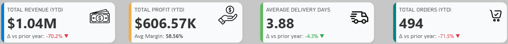
</p>

| **KPI** | **Value / Insight** | **Recommendation** |
|--------|----------------------|---------------------|
| **Total Revenue (YTD)** | **$1.04M**, **–70.2% vs PY**. | Investigate category and region-level collapse. |
| **Total Profit (YTD)** | **$606.57K**, **58.56% margin**, stable YoY. | Leverage stable margin to rebuild volume. |
| **Avg Delivery Days** | **3.88 days**, **–4.3% YoY**. | Maintain speed, highlight in marketing comms. |
| **Total Orders (YTD)** | **494 orders**, **–71.5% vs PY**. | Rebuild order momentum via campaigns and reactivation. |

---

## **A. Revenue, Profit & Margin Over Time**

### ❓ **Business Question**  
**How have revenue, profit, and margin trended historically?**

---

<p align="center">
  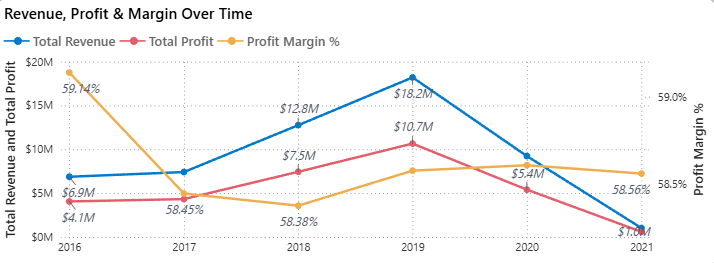
</p>

---

### ⭐ **Insights**

#### **1. Revenue Growth and Collapse**
- Revenue grew from **$6.9M (2016)** to a peak of **$18.2M (2019)**.
- It then dropped sharply to **$9M in 2020**, and shows **$1.0M in 2021**, but **2021 contains only Jan–Feb data**, so annual comparisons should consider this limitation.

#### **2. Profit Decline Was Slower Than Revenue Decline**
- Profit rose from **$4.1M → $10.7M (2019)**.
- It declined to **$5.3M in 2020**, which is *less severe* than the revenue drop.
- The 2021 profit line also looks extremely low due to only two months of data.

#### **3. Profit Margin Remains Highly Stable**
- Despite volume shocks, margin stays between **58.38%–58.56%** after 2017.
- This consistency indicates **strong cost control and pricing discipline**, even during revenue collapse.

#### **4. 2019 Remains the Operational Benchmark**
- Highest revenue  
- Highest profit  
- Strong margin  
- Strong order volume  
- Best alignment of demand + operational performance

---

### 💡 **Action Items**

#### **1. Diagnose the 2020–21 Downturn**
- Identify root causes: supply chain, macro-economic shocks, lost customer cohorts, category failures, or channel issues.

#### **2. Use Margin Stability to Fuel Recovery**
- Since margin integrity is intact, the focus should be on **volume recovery, not margin repair**.

#### **3. Recreate 2016–2019 Playbook**
- Review campaigns, product launches, regional pushes, or assortment strategies that drove the rise to 2019.

#### **4. Strengthen Early Warning Systems**
- Build automated checks for sudden volume dips or channel disruptions.

---

---

## **B. Year-over-Year Revenue Growth (%)**

### ❓ Business Question  
**How volatile has revenue growth been?**

---

<p align="center">
  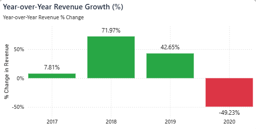
</p>

---

### ⭐ **Insights**

#### **1. Explosive Expansion (2018–2019)**
- **2018: +71.97% growth — breakout year**  
- **2019: +42.65% growth**  
- Back-to-back exceptional years showing strong scalability.

#### **2. Severe Contraction in 2020**
- Revenue **plunged –49.23%**, the largest drop in the dataset.  
- Confirms a major disruption rather than natural market ebbing.

#### **3. High Volatility**
- YoY growth swings from +72% → +43% → –49%.  
- Indicates dependence on key categories/regions and vulnerability to shocks.

---

### 💡 **Action Items**

#### **1. Conduct a Deep Dive on 2020**
- Which categories collapsed?  
- Which regions declined first?  
- Any customer churn patterns?

#### **2. Diversify & Reduce Dependence**
- Expand product and region footprint.  
- Build resilience against category-specific or region-specific shocks.

#### **3. Build Leading Indicator Dashboards**
- Monitor forecast pipeline, order backlog, search demand, promo uplift, supply health.

---

---

## **C. Order Volume & Delivery Speed Over Time**

### ❓ Business Question  
**How have demand and operational efficiency evolved?**

---

<p align="center">
  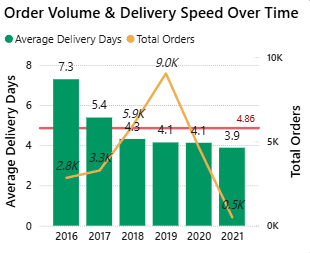
</p>

---

### ⭐ **Insights**

#### **1. Orders Increased Until 2019, Then Collapsed**
- Orders grew from **2.8K → 9.0K (2016–2019)**.
- They then fell dramatically to **5.9K (2020)** and **0.5K (2021)**.

#### **2. Delivery Speed Improved Even as Orders Increased**
- Average delivery time improved from **7.3 days → 4.1 days**, even during years of rising demand.
- This indicates strong process efficiency and scalable fulfillment capability.

#### **3. Post-2019, Delivery Speed Stayed Good but Didn’t Accelerate Further**
- Even as volume plunged in 2020–21, delivery days stayed around **4 days**, not dropping significantly below the historical range.
- This means:
  - Operations remained stable.
  - But the system didn’t capitalize on the lower workload to become even faster.

#### **4. Efficiency Was Maintained Through Volatility**
- No operational degradation during the downturn.
- But no meaningful additional acceleration either.

---

### 💡 **Action Items**

#### **1. Diagnose Order Volume Loss**
- Identify category-level order drivers.  
- Evaluate lost customer segments.

#### **2. Protect Fast Delivery SLAs**
- Fast delivery is a competitive advantage for recapturing demand.

#### **3. Reactivate Channels**
- Use fulfillment strength as a marketing message ("fast delivery guaranteed").

---

---

## **D. Operational Health Trends (Orders, AOV, Margin)**

### ❓ Business Question  
**What do orders, AOV, and margins reveal about health?**

---

<p align="center">
  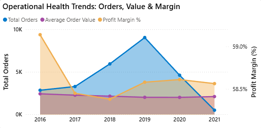
</p>

---

### ⭐ **Insights**

#### **1. Orders Show High Volatility**
- Strong multi-year rise → catastrophic drop after 2019.

#### **2. AOV Remains Surprisingly Stable**
- AOV stays flat across all years, even during the crisis.  
- Customers who remained continued to spend **similar amounts per transaction**.

#### **3. Margin Discipline Is Outstanding**
- Margins stay within a narrow band (~58.4%–59.1%).  
- Confirms superior operational control.

#### **4. Profitability Held Despite Volume Loss**
- Margin stability + stable AOV = strong core operating model.  
- Volume loss is the primary issue.

---

### 💡 **Action Items**

#### **1. Focus on Volume Recovery**
- Not margin repair. The fundamentals are sound.

#### **2. Use Bundling to Lift AOV**
- Accessories, warranties, cross-category pairings.

#### **3. Monitor Order Value Mix**
- Ensure high-margin SKUs still lead in recovery.

---

---

## **E. Cumulative Sales Progress by Year**

### ❓ **Business Question**  
**How do yearly sales trajectories compare, and which years demonstrate the strongest and weakest cumulative revenue momentum?**

---

<p align="center">
  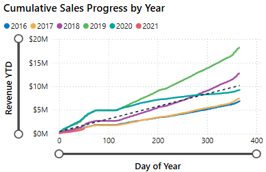
</p>

---

### ⭐ **Insights**

#### **1. 2019 Is the Benchmark Peak**
- Fastest revenue accumulation curve.  
- Outperforms all other years by a large margin.

#### **2. Healthy Momentum in 2017–2018**
- Consistent upward trajectories.  
- Shows predictable seasonal and campaign uplift.

#### **3. 2020 Started Strong, Then Collapsed**
- Early months track above 2019  
- Mid-year plateau indicates sudden disruption.

#### **4. 2021 Is the Lowest Curve on Record**
- Almost flat, reflecting near-zero business activity.

---

### 💡 **Action Items**

#### **1. Study 2019 Drivers**
- Campaigns, category mix, region strategy, promotions.

#### **2. Develop Recovery Playbooks**
- Based on past acceleration points (e.g., March uplift, Q4 surge).

#### **3. Forecasting Enhancements**
- Integrate pattern recognition from past high-performing years.

---

---

## **F. Product Category Profit Contribution Over Time**

### ❓ **Business Question**  
**Which product categories consistently drive profit over time, and how has the category mix shifted during periods of growth and decline?**

---

<p align="center">
  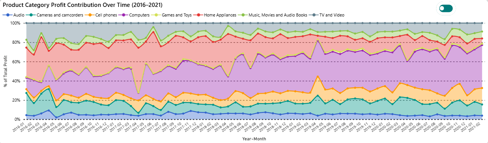
</p>

---

### ⭐ **Insights**

#### **1. Computers & Home Appliances Dominate**
- Consistently the two widest bands → the business foundation.

#### **2. Secondary Categories Provide Meaningful Support**
- Cell Phones, Cameras & Camcorders provide stable secondary contributions.

#### **3. Small Categories Are Predictable and Low Impact**
- Audio, Games, Music/Movies/Audiobooks contribute minimally but consistently.

#### **4. Mix Remains Stable Even During 2020 Shock**
- No major shifts in category share → disruption affected all categories equally.

---

### 💡 **Action Items**

#### **1. Protect Core Categories**
- Maintain investment, marketing, availability.

#### **2. Grow Secondary Profit Drivers**
- Push cell phones, cameras, TV & video through targeted campaigns.

#### **3. Rationalize Long-Tail Categories**
- Evaluate low-performing subcategories for phase-out or repositioning.

---

---

## **G. Regional Profit Contribution Over Time**

### ❓ **Business Question**  
**Which geographic regions contribute most to profitability, and how stable or volatile are these contributions over time?**

---

<p align="center">
  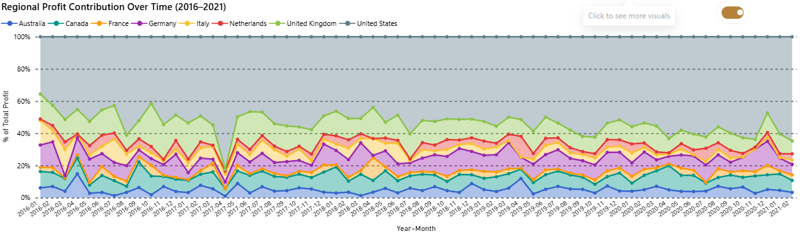
</p>

---

### ⭐ **Insights**

#### **1. The U.S. Is the Profit Engine**
- Largest profit contributor across all years by a large margin.

#### **2. UK & Germany Form a Solid Second Tier**
- Consistent mid-level contributions.

#### **3. Smaller Regions Are Volatile and Low Impact**
- Netherlands, Italy, Australia show fluctuating thin bands.

#### **4. No Significant New Emerging Markets**
- Mix remains structurally similar throughout the years.

---

### 💡 **Action Items**

#### **1. Defend the U.S. Market**
- It's the anchor for total profitability.  
- Prioritize retention, inventory, promotions.

#### **2. Expand UK/Germany**
- Leverage stable performance to unlock incremental gains.

#### **3. Pilot in Smaller Regions Before Investing**
- Validate product-market fit with small bets.

---

## **H. Monthly Sales Heatmap**

### ❓ **Business Question**  
**Which months drive peak performance, where do seasonal slowdowns occur, and how did external disruptions affect monthly sales patterns?**

---

<p align="center">
  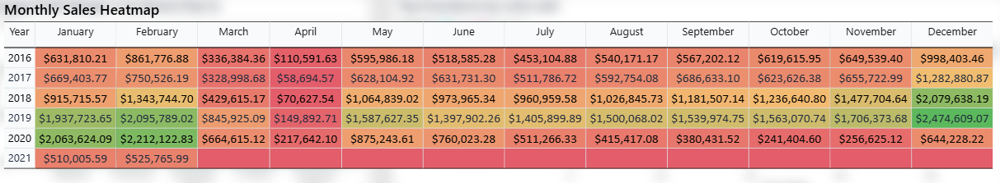
</p>

---

### ⭐ **Insights**

#### **1. Strong Seasonality**
- **Jan–Feb** and **Nov–Dec** are consistently high-performing months.

#### **2. Mid-Year Variability**
- 2018–19 show mid-year surges (May–Sep).

#### **3. 2020 Collapses After March**
- Early success abruptly reverses due to external disruptions.

#### **4. 2021 Shows Systemic Weakness**
- Almost all months below $650K.

---

### 💡 **Action Items**

#### **1. Double Down on Peak Seasons**
- Match inventory, promos, staffing to Jan–Feb and holiday periods.

#### **2. Mitigate Spring Slowdowns**
- Launch mid-year promos or category spikes.

#### **3. Rebuild Post-2020 Momentum**
- Understand what worked in early 2020 and duplicate in recovery.

---

## 🏁 **Act 2 Summary**

GE experienced a **strong rise to a 2019 peak** driven by solid category mix and operational efficiency.  
A severe downturn in 2020–21 hit volume and revenue hard, but **margins, AOV, and cost control held steady**, proving strong internal resilience.  
Future strategy must prioritize **volume recovery**, **regional expansion**, and **seasonal optimization** while safeguarding the profitable core categories.

---

# 🟩 ACT 3 — Customer Insights & Retention Analysis

This section focuses on **who Global Electronics’ customers are**, **which segments drive value**, and **how engagement and lifetime value evolve over time**. The goal is to translate customer demographics, value metrics, recency, and cohort behavior into a clear **retention and reactivation strategy**.

---

## 📸 **Customer Insights Dashboard — Full View**

> **🔎 Click a link below to view each full dashboard page:**

- **📄 Page 1:** [Open Image](Dashboard_Screenshots/05_Customer_Dashboard/Customer_Insights_1.jpg)
- **📄 Page 2:** [Open Image](Dashboard_Screenshots/05_Customer_Dashboard/Customer_Insights_2.jpg)
- **📄 Page 3:** [Open Image](Dashboard_Screenshots/05_Customer_Dashboard/Customer_Insights_3.jpg)
- **📄 Page 4:** [Open Image](Dashboard_Screenshots/05_Customer_Dashboard/Customer_Insights_4.jpg)

---

## 📌 **KPI Summary**

These KPIs summarize **2021 year-to-date** customer performance, with comparisons to the prior year based on the KPI card reference labels.

<p align="center">
  
</p>

| **KPI** | **Value & Insight (2021, YTD)** | **Action Recommendation** |
|--------|----------------------------------|---------------------------|
| **Active Customers (YTD)** | **485 active customers** out of **15K total**, reflecting a very small engaged base relative to the full customer file. | Prioritize reactivation and engagement programs to bring lapsed and dormant customers back into the active pool. |
| **Average Order Value (AOV)** | **$2.10K**, with **+4.6% vs prior year**, indicating customers who remain active still spend slightly more per transaction. | Protect this high-value behavior while designing smaller-ticket or add-on offers to increase order frequency. |
| **Customer Lifetime Value (CLTV)** | **$2.14K**, with **–1.6% vs prior year**, suggesting lifetime value is slipping as fewer customers stay active long-term. | Introduce CLTV-boosting strategies: tailored upsell paths, post-purchase journeys, and loyalty rewards. |
| **New Customers (YTD)** | **66 new customers**, with **–82.0% vs prior year**, showing a severely weakened acquisition funnel post-2019. | Rebuild acquisition with targeted campaigns, better audience targeting, and refreshed messaging/positioning. |

---

---

## 👥 A. Customer Demographics by Age & Gender

### ❓ Business Question  
**Which age and gender segments form the core customer base, and where should targeting and engagement efforts focus?**

---

<p align="center">
  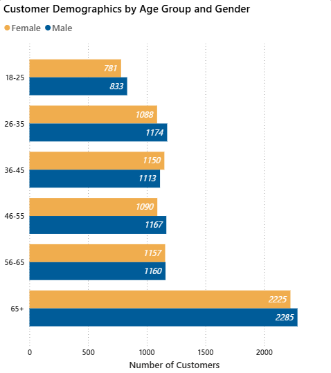
</p>


### ⭐ Key Insights

#### 1. **Senior-heavy customer base**  
   The **65+ age group is the single largest segment** (over 4.5K customers), making older customers the primary foundation of the portfolio.

#### 2. **Balanced gender split**  
   Male and female counts are relatively balanced in every age group, meaning **performance is driven more by age and lifecycle than by gender bias**.

#### 3. **Middle-aged customers form the stable core**  
   Age groups **26–65** contribute a broad, stable customer base, representing long-term, repeat buyers.

#### 4. **Young customers are underrepresented**  
   The **18–25 cohort is the smallest**, signaling limited penetration into younger demographics and potential future growth risk.
   
### 💡 Action Recommendations

#### 1. **Design for seniors first**  
   - Tailor communication, UX, and service offerings for **65+ customers**.
   - Build **senior-focused engagement programs**, emphasizing ease of use, support, and relevant offers.

#### 2. **Protect and nurture the 26–65 core**  
   - Invest in evergreen retention programs and cross-sell campaigns for **mid-life cohorts**, who form a dependable revenue backbone.
   - Strengthen **mid-life customer retention** with loyalty rewards and recurring purchase incentives.

#### 3. **Develop a youth acquisition strategy**  
   - Experiment with campaigns, offers, and channels aimed at **18–25 customers** to diversify the age mix and secure future demand.
   - Launch **youth awareness campaigns** targeting the 18–25 range (student discounts, digital-first messaging, influencer tie-ins).
   - Conduct **product-fit analysis** for younger demographics to identify missing offerings or UX gaps.
   
---

---

## 💰 B. Revenue & Profit by Age & Gender

### ❓ Business Question  
**Which demographic segments generate the highest financial contribution?**

---

<p align="center">
  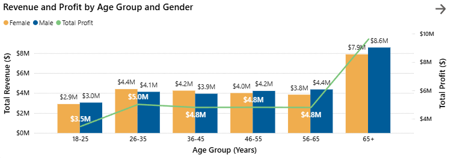
</p>

### ⭐ Key Insights

#### 1. **Seniors are the strongest financial engine**  
   The **65+ segment** delivers the **highest revenue and profit for both genders**, with male seniors slightly ahead of female seniors.

#### 2. **26–65 segments are strong but plateaued**  
   Revenue from **26–65 groups** is steady and substantial but does not accelerate, suggesting maturity rather than growth.

#### 3. **Younger segment is structurally weaker**  
   **18–25** shows materially lower revenue and profit. This is consistent with demographic underrepresentation and indicates a **strategic blind spot**.

#### 4. **Profit tracks revenue predictably**  
   The profit line closely follows the revenue distribution across age groups, implying **margin consistency by age** and simplifying prioritization by revenue impact.

### 💡 Action Recommendations

#### 1. **Double down on senior-focused value propositions**  
   Senior customers respond well to the current offering; reinforce with loyalty tiers, service guarantees, and tailored bundles.

#### 2. **Stabilize and modestly upgrade 26–65 performance**  
   Focus on **CLTV growth** (upsell, cross-sell, warranties) rather than aggressive acquisition in already-penetrated age groups.

#### 3. **Create a targeted plan for 18–25**  
   Develop product packs, digital campaigns, and messaging that resonate with **younger professionals and first-time buyers**.
   
---

---

## 💳 C. CLTV & AOV by Age Group & Gender

### ❓ Business Question  
**Which demographic groups have the highest lifetime value and spending potential?**

---

<p align="center">
  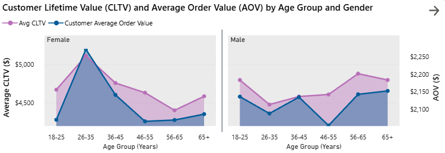
</p>

### ⭐ Key Insights

#### 1. **Females 26–35 show the highest CLTV**  
   This group stands out with **peak CLTV (> $5.5K)** and slightly higher AOV, marking them as a **high-potential premium segment**.

#### 2. **Male CLTV improves with age**  
   Male CLTV **climbs in 56–65 and 65+ groups**, suggesting **loyalty and repeat purchases increase with age** among male customers.

#### 3. **Mid-life CLTV dips for females**  
   Female CLTV dips in **36–55** age bands pointing to **retention or engagement issues** rather than spending power.

#### 4. **AOV is stable across segments**  
   Both genders maintain AOV around **$2.1K–$2.25K**, indicating **transaction size is predictable**, and differences in CLTV are mainly driven by frequency and tenure.

### 💡 Action Recommendations

#### 1. **Maximize value from 26–35 females**  
   Offer **premium bundles, members-only perks, and targeted communications** to deepen loyalty in this high-CLTV group.

#### 2. **Build structured loyalty programs for senior males**  
   Senior male customers respond with higher CLTV, so design **tiered rewards, service upgrades, and long-term engagement** paths.

#### 3. **Fix mid-life female retention gaps**  
   Investigate experience, product relevance, and communication quality for **36–55 females**, then plug churn drivers with better journeys and offers.

#### 4. **Use stable AOV in forecasting and offer design**  
   Since AOV is consistent, focus experimentation on **frequency and lifecycle triggers**, not aggressive discounting that may erode margins.
   
---

---

## ⏳ D. Customer Value Decay by Recency

### ❓ Business Question  
**How does customer value deteriorate as customers become inactive?**

---

<p align="center">
  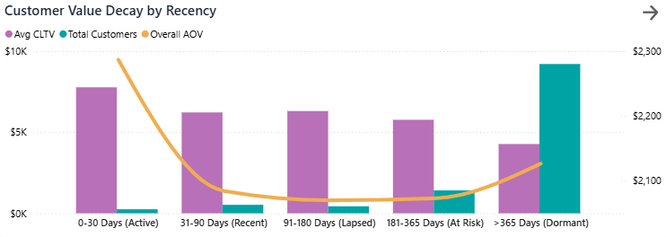
</p>

### ⭐ Key Insights

#### 1. **CLTV erodes quickly with recency**  
   Customers in the **0–30 day (Active)** bucket show the **highest CLTV**, which decays steadily as customers move into **Recent, Lapsed, At Risk, and Dormant**.

#### 2. **Dormant segment is huge but underproductive**  
   The **Dormant (>365 days)** segment has the **largest customer count** but the **lowest CLTV**, meaning most of the database is not actively contributing revenue.

#### 3. **AOV is volatile at the extremes**  
   AOV is high for **Active** customers, dips in **middle recency buckets**, and can spike in **Dormant** due to occasional large, one-off purchases.

#### 4. **Healthiest economics are tightly linked to recency**  
   The combination of **high CLTV + high AOV + low customer count** in the Active segment confirms **engagement is the primary driver of value**.

### 💡 Action Recommendations

#### 1. **Protect and nurture Active customers obsessively**  
   Use **post-purchase journeys, exclusive offers, and proactive communication** to keep 0–30 day customers engaged and prevent early lapse.

#### 2. **Deploy structured win-back flows for At Risk and Dormant**  
   Create **tiered reactivation campaigns** (e.g., soft reminder → stronger incentive → “last-chance” offer) based on recency buckets.

#### 3. **Test high-impact reactivation offers**  
   For high-AOV Dormant customers, consider **personalized offers**, VIP reactivation messages, or category-specific nudges.

#### 4. **Integrate recency into CRM/marketing automation**  
   Make recency a first-class segmentation dimension in all lifecycle campaigns.

---

---

## 🔄 E. Customer Acquisition & Retention Trends (2016–2021)

### ❓ Business Question  
**How have acquisition, active users, and returning customers evolved over time?**

---

<p align="center">
  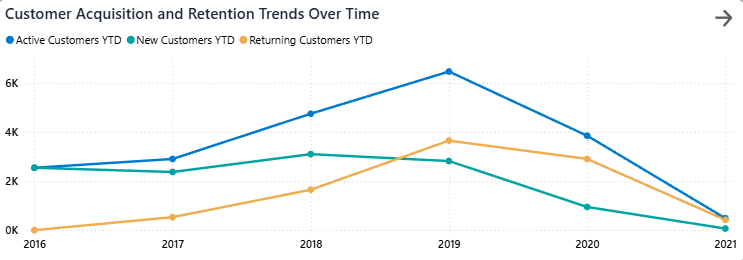
</p>

### ⭐ Key Insights

#### 1. **2019 is the engagement peak**  
   Active and returning customers **peak in 2019**, confirming this as the high-water mark of customer health. Number of new customers peaked in 2018 and almost matched it in 2019.

#### 2. **Post-2019 collapse across all segments**  
   From 2019 to 2021, **active customers fall from ~6,500 to ~400**, and **new customers fall from ~3,000 to ~200**. Returning customers mirror this drop.

#### 3. **Acquisition and retention failed together**  
   The synchronized decline of new and returning customers indicates **a systemic shock**, not just one weak area.

#### 4. **2021 is a structural low point**  
   2021 levels are close to or below early 2016 baseline, effectively **undoing multiple years of customer base growth**.

### 💡 Action Recommendations

#### 1. **Design a full-funnel recovery plan**  
   Address both **top-of-funnel (new customers)** and **mid-funnel (returning customers)** with dedicated acquisition and retention strategies.

#### 2. **Reactivate lapsed 2018–2019 cohorts**  
   Target customers acquired in **peak years** who have since gone quiet with **“We miss you” and “win-back” campaigns**.

#### 3. **Rebuild acquisition with new channels**  
   Test new paid channels, partnerships, and referral programs to re-open the acquisition pipeline.

#### 4. **Track customer health as a core KPI**  
   Elevate active / new / returning customer trends to **executive-level dashboards**.

---

---

## 📊 F. Customer Retention Cohort Analysis

### ❓ Business Question  
**How well do customer cohorts retain over time, and which periods show the strongest/worst retention?**

---

<p align="center">
  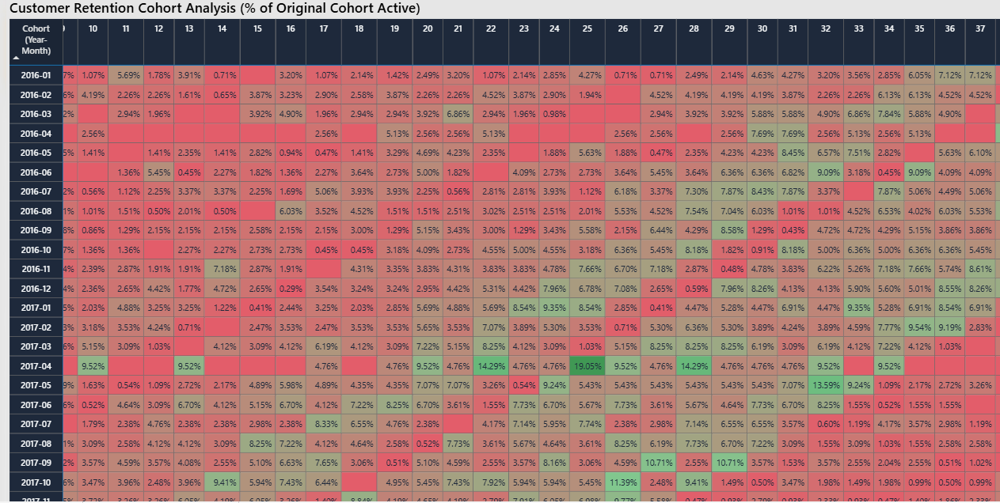
</p>

### ⭐ Key Insights

#### 1. **Classic retention decay pattern**  
   Most cohorts start with decent early retention, then **decay quickly** over subsequent months.

#### 2. **2016–2018 contain the strongest cohorts**  
   Several cohorts from these years maintain **7–14% retention over many periods**, reflecting strong product-market resonance.

#### 3. **Recent cohorts are weaker and more fragile**  
   **2020–2021 cohorts** show mostly red cells (low retention), suggesting onboarding and engagement issues in more recent years.

#### 4. **Few long-lasting “evergreen” cohorts**  
   Only a limited number of cohorts maintain strong retention beyond **12–18 months**, making them valuable examples for best-practice analysis.

### 💡 Action Recommendations

#### 1. **Study high-retention cohorts in detail**  
   Deep dive into what was different in **2016–2018**: offers, product mix, channel strategy, or onboarding campaigns.

#### 2. **Improve onboarding and early lifecycle experiences**  
   Focus on the first **90 days** of the customer journey with educational, value-focused communication.

#### 3. **Use cohort performance as a success metric**  
   Treat cohort retention as a **core KPI** when evaluating new campaigns or launches.

#### 4. **Prioritize structural fixes over one-off pushes**  
   Rather than short-term boosts, design **systemic retention levers** (loyalty, subscription, service programs).

---

---

## 🔍 G. RFM Segmentation (Recency–Frequency–Monetary)

### ❓ Business Question  
**Which customer clusters hold the highest potential for retention, reactivation, and value growth?**

---

<p align="center">
  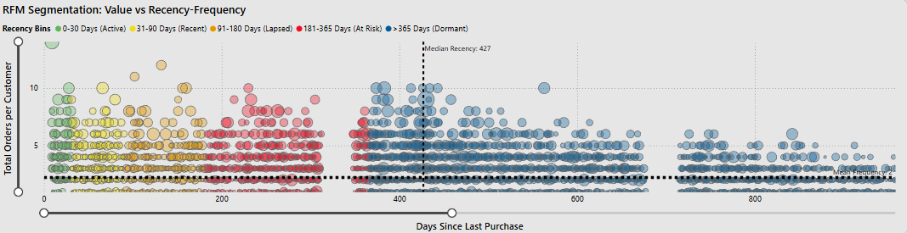
</p>

### ⭐ Key Insights

#### 1. **Dormant customers dominate by volume but not value**  
   The **Dormant (>365 days)** cluster holds the **largest headcount**, mostly with low frequency and modest value.

#### 2. **Active and Recent segments contain the true “VIPs”**  
   High-frequency, high-value customers are almost exclusively in **Active (0–30 days)** and **Recent (31–90 days)** buckets.

#### 3. **Median recency is 427 days**  
   This means the median customer is effectively **dormant**, reinforcing the earlier insight about a very small active core.

#### 4. **Frequency is the scarce asset**  
   Very few customers exceed **10 orders**, and those who do are disproportionately valuable; losing them would severely impact CLTV.

### 💡 Action Recommendations

#### 1. **Concentrate premium programs on Active/Recent clusters**  
   Provide **exclusive benefits, early access, and priority support** to keep high-value clusters engaged.

#### 2. **Build targeted win-back for Lapsed and At Risk**  
   Use **RFM thresholds** to trigger campaigns before customers fall fully into Dormant.

#### 3. **Segment Dormant customers by historical value**  
   Treat high-Monetary dormant customers differently from low-Monetary ones: **personal outreach vs. scaled campaigns**.

#### 4. **Operationalize RFM in CRM systems**  
   Bake RFM scores into your CRM and marketing automation stack so retention logic is **continuous, not manual**.

---

## 🏁 **Act 3 Summary**

Customer analysis shows a business heavily reliant on **senior and middle-aged customers**, with **shrinking active users**, strong **AOV and CLTV**, but significant **acquisition and retention weaknesses**.  
The biggest growth levers lie in **reactivation**, **youth-segment outreach**, **lifecycle marketing**, and strengthening **high-value cohorts**.

---

# 🟥 **ACT 4 — Regional Performance Analysis (Initial Section)**

This section analyzes **where Global Electronics makes its money** and **how efficiently stores convert space into revenue and profit**.  
We move from global regions down to countries, states, and finally store-level performance to identify **high-performing markets**, **underperforming regions**, and **store efficiency gaps**.

---

## 📸 Region Dashboard — Full View  

> **🔎 Click a link below to view each full dashboard page:**

- **📄 Page 1:** [Open Image](Dashboard_Screenshots/06_Region_Dashboard/Regional_Performance_1.jpg)
- **📄 Page 2:** [Open Image](Dashboard_Screenshots/06_Region_Dashboard/Regional_Performance_2.jpg)
- **📄 Page 3:** [Open Image](Dashboard_Screenshots/06_Region_Dashboard/Regional_Performance_3.jpg)
- **📄 Page 4:** [Open Image](Dashboard_Screenshots/06_Region_Dashboard/Regional_Performance_4.jpg)
- **📄 Page 5:** [Open Image](Dashboard_Screenshots/06_Region_Dashboard/Regional_Performance_5.jpg)

---

## 📌 KPI Summary

These KPIs summarize **regional and store-level performance for 2021 (YTD)** with the **Year slicer set to 2021**, giving a consistent basis for interpreting the visuals.

<p align="center">
  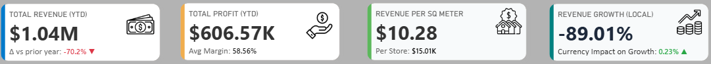
</p>

| **KPI** | **Value & Insight** | **Recommended Action** |
|--------|----------------------|------------------------|
| **Total Revenue (YTD)** | **$1.04M**, with **–70.2% vs prior year**, reflecting a dramatic revenue collapse in 2021 relative to 2020. | Prioritize regional and store-level actions that restore volume in proven markets (North America, key European countries). |
| **Total Profit (YTD)** | **$606.57K**, with an average margin of **58.56%**, consistent with historical levels despite the revenue crash. | Leverage margin stability to support aggressive but controlled growth plans without resorting to heavy discounting. |
| **Revenue per Sq. Meter (YTD)** | **$10.28/sqm** in 2021 vs **$551.09/sqm** when all years are selected, highlighting how underutilized current store capacity is. | Reassess store footprint, optimize floor space productivity, and consider consolidation in chronically underperforming locations. |
| **Revenue per Store (YTD)** | **$15.01K per store** vs **$805.06K per store** across all years, reinforcing the scale of 2021 underperformance. | Focus on turning around low-productivity stores and reallocating resources to high-efficiency locations. |
| **Revenue Growth (Local)** | **–89.01% local revenue growth**, with **currency impact only ~0.23%**, confirming that performance issues are operational/market-driven, not FX-driven. | Address demand, channel, and execution problems directly; FX is not the main story. |

---

---

## 🌍 A. Regional Revenue Distribution Map

### ❓ Business Question  
**Which regions drive revenue today, and how is revenue growth distributed geographically?**

---

<p align="center">
  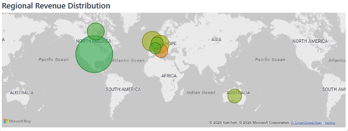
</p>

### ⭐ Key Insights

#### 1. **North America Is the Global Stronghold**
- Highest revenue concentration, especially the **United States and Canada**.
- Strong existing penetration, mature customer base, and high store density.

#### 2. **Europe Shows Mixed Strength**
- UK, Germany, France, Netherlands, and Italy generate meaningful revenue.
- Growth coloring (yellow/orange/red) indicates mostly **flat or declining YoY growth**.

#### 3. **Australia Is a Small but Stable Contributor**
- Low total revenue but relatively consistent performance.
- Represents niche but steady demand.

#### 4. **Growth Hotspots Are Minimal**
- Green zones (positive YoY growth) are rare.
- Most regions show **negative or weak YoY growth**, likely tied to post-2019 downturn.

#### 5. **Massive Untapped Opportunity in Asia, South America, Africa**
- Almost no footprint.
- Represents potential future expansion zones.

### 💡 Action Recommendations

#### 1. **Defend large but weakening markets**  
   For big red/yellow regions, focus on **retention, pricing, and local competitive strategy** to stabilize demand.

#### 2. **Invest in green, growing pockets**  
   Explore whether **smaller but green markets** can be scaled with targeted investments.

#### 3. **Explore underpenetrated continents**  
   Build a **longer-term expansion roadmap** for Asia, South America, and parts of Africa where product fit may be strong but presence is limited today.

#### 4. **Align regional playbooks with growth signals**  
   Use the **growth color coding** to prioritize where to push aggressively vs where to optimize and defend.

---

---

## 💰 B. Revenue, Profit & Margin by Country

### ❓ Business Question  
**Which countries deliver the most revenue and profit, and where are margins strongest?**

---

<p align="center">
  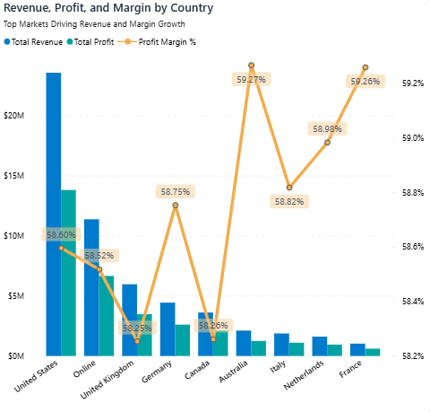
</p>

### ⭐ Key Insights

#### 1. **US is the primary profit and revenue engine**  
   The US stands far above other countries in both revenue and profit, providing the **core economic base** for the business.

#### 2. **Online is meaningful but lower margin**  
   The “Online” channel contributes significantly to revenue but operates at a **slightly lower margin** than the physical leaders, hinting at different cost or pricing structures.

#### 3. **France and Australia show relatively high margins**  
   Some European markets (e.g., France) and Australia exhibit **slightly higher margins (~59%+)** compared to peers, though the absolute differences are small (within ~1–2%).

#### 4. **Margin spread is narrow across countries**  
   Most countries sit within a **tight 1–2% margin band** around 58–59%, meaning **performance differences are driven more by revenue scale than margin gaps**.

### 💡 Action Recommendations

#### 1. **Use the US as a strategic anchor**  
   Maintain strong execution in the US: **assortment, service, and store operations** should remain best-in-class.

#### 2. **Leverage learnings from high-margin countries**  
   Study **France and Australia** to understand subtle process or pricing advantages, and transfer applicable practices to similar markets.

#### 3. **Optimize Online unit economics**  
   Examine **fulfillment, discounting, and marketing costs** in the Online channel to move its margin closer to the physical network.

#### 4. **Set country targets based on scale potential**  
   Since margins are fairly uniform, **growth priorities should follow revenue headroom and addressable market size**, not just current profitability.

---

---

## 🌐 C. Regional Performance Summary (Matrix)

### ❓ Business Question  
**How do continents and regions compare across revenue, profit, CLTV, and store efficiency metrics?**

---

<p align="center">
  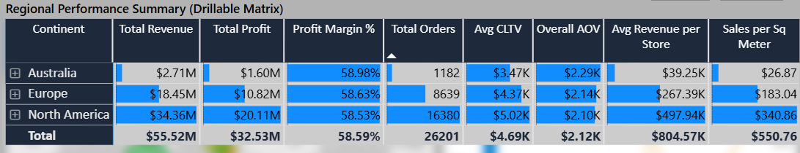
</p>

### ⭐ Key Insights

#### 1. **North America leads across all major metrics**  
   North America dominates in **revenue, profit, order count, CLTV, and sales per sqm**, making it the **core strategic region**.

#### 2. **Europe is solid but structurally smaller**  
   European regions show **respectable margins and AOV**, but lower totals in revenue and orders, reflecting a **smaller scale footprint**.

#### 3. **Australia significantly lags**  
   Australia sits at the **bottom across most metrics**, highlighting an underperforming region that either needs **a new strategy or a reconsideration of its role**.

#### 4. **Store metrics reinforce geographic gaps**  
   Sales per sqm and revenue per store mirror the broader pattern: **North America strongest, Europe mid-tier, Australia weakest**.

### 💡 Action Recommendations

#### 1. **Continue aggressive optimization and growth in North America**  
   Use North America as the **testing ground for new initiatives** and as the main engine for revenue recovery.

#### 2. **Run targeted uplift programs in key European countries**  
   Focus on **improving CLTV and order frequency** in Europe to increase total contribution without over-expanding footprint.

#### 3. **Re-evaluate the long-term strategy for Australia**  
   Decide whether Australia should be **fixed, repositioned, or gradually deprioritized**, based on updated market and profitability analysis.

#### 4. **Use the matrix as a strategic control panel**  
   Treat this view as a **top-level portfolio management tool** guiding where to invest, where to optimize, and where to consider exiting.

---

---

## 🏛️ D. Top 6 States by Revenue

### ❓ Business Question  
**Which states are the biggest revenue contributors, and how concentrated is state-level performance?**

---

<p align="center">
  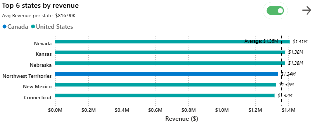
</p>

### ⭐ Key Insights

#### 1. **A mix of US and Canadian leaders**  
   States like **Nevada, Kansas, Nebraska, and Northwest Territories** dominate the top positions, showing that **both US and Canada contribute significantly** at the state/territory level.

#### 2. **All top states sit comfortably above the average line**  
   The built-in average line shows that **all top-6 states outperform the network average**, indicating a well-defined high-performing cluster.

#### 3. **Revenue concentration risk is moderate, not extreme**  
   The gaps between these top states are meaningful but not extreme, so **revenue is shared across multiple strong states rather than hinging on a single outlier**.

#### 4. **States pattern may reflect store clustering or demographic fit**  
   The leading states likely reflect **both store density and strong local product-market fit**.

### 💡 Action Recommendations

#### 1. **Protect and support top states with dedicated account management**  
   Ensure **inventory priority, local marketing, and strong store leadership** in these regions.

#### 2. **Use top states as playbook templates**  
   Analyze what makes these states successful (demographics, channel mix, assortment), and **adapt those patterns in next-tier states**.

#### 3. **Monitor for early plateau or saturation**  
   Track **growth trends** in top states; if they're flattening, explore new levers (e.g., new categories, services, or micro-markets).

#### 4. **Look for adjacent state expansion opportunities**  
   Use these states as hubs from which to **expand to neighboring regions** with similar customer profiles.

---

---

## 🟥 E. Bottom 6 States by Revenue

### ❓ Business Question  
**Which states are underperforming, and are they worth fixing, restructuring, or exiting?**

---

<p align="center">
  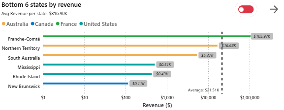
</p>

### ⭐ Key Insights

#### 1. **Four states with extremely low revenue (< $6K)**  
   **New Brunswick, Rhode Island, Mississippi, and South Australia** sit clearly at the bottom, with **sub-$6K revenue**, indicating extremely weak performance.

#### 2. **Franche-Comté and Northern Territory are low but not catastrophic**  
   **Franche-Comté (France)** and **Northern Territory (Australia)** are part of the bottom six but **sit above the absolute laggards**, with higher revenue levels, especially on the log-scale axis.

#### 3. **Geographic diversification of weak states**  
   The bottom six are spread across **multiple countries**, showing that underperformance is **not confined to one geography** and is likely driven by local factors.

#### 4. **Bottom states fall well below the network average**  
   The average revenue line is significantly above all six, underscoring how far these states lag behind the rest of the network.

### 💡 Action Recommendations

#### 1. **Perform viability assessments for the bottom four**  
   For **New Brunswick, Rhode Island, Mississippi, and South Australia**, evaluate whether to **fix, re-position, or gradually exit**.

#### 2. **Test targeted interventions where there is some traction**  
   For **Franche-Comté and Northern Territory**, pilot **local campaigns, assortment tweaks, or channel adjustments** before considering more drastic action.

#### 3. **Use top-state learnings to uplift selected weak markets**  
   Where demographics and channels are comparable, apply **top-state best practices** to see if bottom states respond before reallocating capital.

#### 4. **Make state-level performance part of governance**  
   Use these state charts as a **regular dashboard for portfolio decisions** (closures, remodels, investments).

---

---

## 🏪 F. Top 6 Stores by Sales Efficiency

### ❓ Business Question  
**Which stores make the best use of their floor space and margin profile?**

---

<p align="center">
  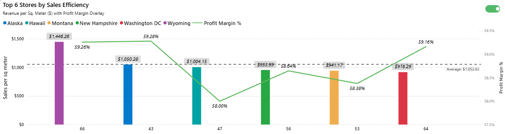
</p>

### ⭐ Key Insights

#### 1. **High-performing stores achieve strong sales density**  
   Stores in locations like **Wyoming, Alaska and Hawaii** deliver **top-tier revenue per sqm**, positioning them as **efficiency leaders** in the network.

#### 2. **Margins differ only slightly**  
   All top stores hover around **58–59% margin**, indicating that **efficiency differences are driven mainly by revenue density**, not by structurally different margins.

#### 3. **Geographic diversity among top stores**  
   The top 6 are **spread across multiple states**, suggesting store-level management, local competition, and micro-market dynamics matter as much as national context.

#### 4. **Consistency in margin suggests scalable economics**  
   Since margins are similar, replicating **traffic and conversion drivers** from top stores can produce similar economics elsewhere.

### 💡 Action Recommendations

#### 1. **Benchmark store operations and behaviors**  
   Analyze **staffing models, store layouts, local marketing, and assortment decisions** at top stores, then codify them into best practices.

#### 2. **Promote top stores as pilot locations**  
   Use these stores to **test new concepts, merchandising, and in-store experiences** before rolling out to the wider network.

#### 3. **Support top stores with growth initiatives**  
   Help them expand category penetration, upsell attachment rates, and cross-sell to **fully exploit their strong traffic base**.

#### 4. **Set sales-per-sqm targets informed by these leaders**  
   Use top store performance as a **benchmark, not an anomaly**, when setting sales efficiency goals.

---

---

## 📉 G. Bottom 6 Stores by Sales Efficiency

### ❓ Business Question  
**Which stores are underutilizing their space, and what should be done about them?**

---

<p align="center">
  
</p>

### ⭐ Key Insights

#### 1. **Very low revenue per sqm in the bottom group**  
   Stores in **New Brunswick, Northern Territory, South Australia, Rhode Island, Mississippi**, and **Bavaria** deliver **far lower sales per sqm** than the network average.

#### 2. **Margins are not significantly worse**  
   Profit margins generally remain in the **same 58–59% band**, implying that **pricing and product economics are not the main issue**.

#### 3. **The problem is demand and throughput, not unit economics**  
   With margins in line but sales density low, the key constraint appears to be **footfall, local demand, or conversion**, not cost structure.

#### 4. **These stores span different countries and regions**  
   Weak store performance is **localized** and not simply tied to one country or region.

### 💡 Action Recommendations

#### 1. **Run detailed store diagnostics**  
   Assess **traffic, local competition, product relevance, staff capability, and marketing intensity** at each of these locations.

#### 2. **Pilot corrective actions before deciding on closure**  
   Test **layout changes, assortment adjustments, local campaigns, and staffing optimization** to see if performance can be salvaged.

#### 3. **Set clear performance thresholds and timelines**  
   If, after interventions, stores still underperform, **consider consolidation or closure** to free up capital.

#### 4. **Use bottom stores to understand structural vs fixable issues**  
   Distinguish between **location-driven constraints** (hard to fix) and **execution-driven issues** (fixable with better operations).

---

---

## 📊 H. Store Profitability Matrix (Revenue vs Margin)

### ❓ Business Question  
**How do stores cluster by revenue and margin, and what does this imply at a country level about store network health?**

---

<p align="center">
  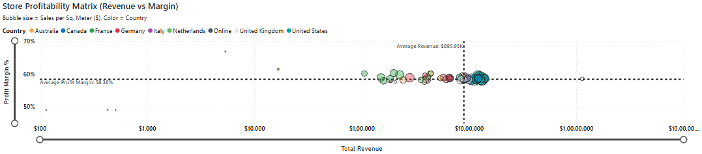
</p>

<p align="center">
  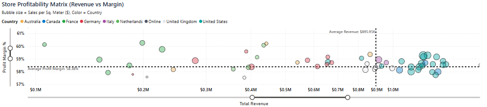
</p>

### ⭐ Key Insights

#### 1. **US and Canadian stores tend to cluster in the higher-revenue band**  
   The matrix shows many **US and Canada stores in the upper ranges of revenue**, often with margins in the **58–59% range**, making them the **backbone of the store network**.

#### 2. **European stores are more scattered in revenue**  
   European stores (e.g., Germany, France, UK) display **more dispersion in revenue**, though margins remain fairly homogeneous.

#### 3. **Australian stores cluster toward the lower revenue end**  
   Australian stores tend to fall **closer to the lower-revenue region** of the matrix, suggesting **underutilized potential**.

#### 4. **Margin is tightly clustered; revenue is the main differentiator**  
   Because margins sit within a **narrow 1–2% band**, store performance differences are **primarily driven by volume and sales per sqm**, not structural profitability per order.

### 💡 Action Recommendations

#### 1. **Use country-level clustering to prioritize network strategy**  
   Focus **expansion, remodels, and capital allocation** on countries whose stores cluster in the **upper revenue bands**.

#### 2. **Design targeted uplift plans for under-clustered countries**  
   For countries where most stores are **low-revenue**, build **country-specific initiatives** (pricing, assortment, partnership, or marketing) to lift the entire cluster.

#### 3. **Treat store-level variability as an execution lever**  
   With margins stable, focus on **traffic, conversion, and basket size** as key levers, not cost realignment.

#### 4. **Integrate this matrix into ongoing portfolio reviews**  
   Make **store cluster health** part of quarterly or annual strategic reviews to guide openings, refurbishments, and closures.

---

## 🏁 Act 4 Summary

Regional and store performance analysis shows a business that is **structurally healthy in North America**, **moderately strong in Europe**, and **weak in Australia**, with **store efficiency varying substantially by location but only slightly by margin**.  
The path forward lies in **defending and growing core regions**, **fixing or exiting chronic underperformers**, and **replicating high-efficiency store and state best practices across the wider network**.

---

---

# 📌 **6. Insights → Recommendations Summary Sheet**

This section consolidates all major findings across the four acts of the project and converts them into clear, actionable business recommendations for Global Electronics (GE). It also outlines a strategic roadmap answering the most important question:

## 🎯 **What Should GE Do Next?**

---

## 🧭 **1. Consolidated Recommendation Summary**

#### 🟦 **Product & Portfolio Strategy**
- **Double-down on core revenue drivers** (Computers, Home Appliances).  
- **Revitalize underperforming subcategories** through price correction, bundling, or repositioning.  
- **Phase out or repurpose “Dog” SKUs** with persistent low demand.  
- **Expand high-margin “hidden gem” categories**, especially Cameras & Media.

---

#### 🟩 **Sales & Operational Strategy**
- **Restore pre-2020 volume levels** by replicating 2018–2019 campaign and category strategy.  
- **Use delivery performance as a differentiator**, highlighting fast SLAs.  
- **Exploit seasonal peaks** (Jan–Feb, Nov–Dec) with inventory planning and promotions.  
- **Introduce mid-year stabilisation offers** to mitigate March–April slowdowns.

---

#### 🟧 **Customer & Retention Strategy**
- **Reactivation is the biggest opportunity**. Dormant customers (>365 days) form the largest segment.  
- **Rebuild acquisition funnels** with digital ads, referral programs, and partnerships.  
- **Personalize lifecycle engagement** based on CLTV, AOV and RFM scoring.  
- **Target high-value demographics** (senior customers, 26–35 female group, high-spend cohorts).

---

#### 🟪 **Regional Expansion Strategy**
- **Defend and scale North America**, the anchor region.  
- **Invest selectively in Europe** (France, Germany, UK) where margins are strong.  
- **Fix or reposition Australia**, which underperforms across almost every metric.  
- **Pilot small-format or online-first entry** into Asia and Latin America for long-term growth.  
- **Benchmark country-level best practices** from US, France, Germany.

---

## 🚀 **2. Strategic Roadmap for the Next 12 Months**

Based on the "Volume vs. Margin" diagnosis I established in Act 2, I have developed the following 12-month strategic roadmap. I prioritized these actions to focus first on low-cost/high-impact retention levers before suggesting capital-intensive expansion.

---

### **Q1 — Stabilisation & Diagnostic Phase**
#### 🔍 **Immediate Priorities**
- Perform **root-cause analysis** of 2020–2021 volume collapse.  
- Audit underperforming **regions (Australia), states, and low-ROI SKUs**.  
- Build automated **early-warning dashboards** for sudden revenue/order drops.

#### ⚙️ **Foundational Fixes**
- Clean up SKU catalog (retire, consolidate, reclassify).  
- Standardise pricing and margin monitoring across categories/regions.  

---

### **Q2 — Customer & Volume Recovery Phase**
#### 🧲 **Retention & Reactivation**
- Launch reactivation campaigns targeting **Dormant** and **At-Risk** segments.  
- Introduce personalised **email/SMS/app flows** based on RFM and recency.

#### 📈 **Demand Generation**
- Run theme-based promotions in slow months (March–April).  
- Launch acquisition campaigns tailored to younger demographics.

---

### **Q3 — Expansion & Growth Phase**
#### 🌍 **Regional Expansion**
- Scale proven playbooks from US & France into mid-tier European regions.  
- Pilot **online-first market entry** into 1–2 new regions.

#### 🛒 **Product & Category Growth**
- Expand high-margin categories and bundles.  
- Introduce premium add-ons to lift CLTV.

---

### **Q4 — Performance Optimisation Phase**
#### 📊 **Operational Excellence**
- Implement best practices from top stores into national rollouts.  
- Fine-tune inventory allocation using seasonal patterns.

#### 🎁 **Holiday Peak Execution**
- Bulk up inventory for Computers & Home Appliances—biggest Q4 winners.  
- Push fast-shipping incentives and limited-time bundles.

---

## 📝 **3. Executive-Level Summary (One-Liner Answers)**

### **✓ How can GE grow revenue?**  
Recover volume through targeted campaigns, fix weak regions, and invest in high-margin categories.

### **✓ How can GE grow profit?**  
Maintain margin discipline, eliminate low-ROI SKUs, and double-down on profitable product/region pairs.

### **✓ How can GE improve customer retention?**  
Activate dormant customers, personalize engagement flows, and build loyalty among senior/high-value segments.

### **✓ How should GE prioritise regions?**  
North America first, Europe second, Australia fix-or-restructure, and pilot emerging markets.

### **✓ What is GE’s biggest missed opportunity?**  
Re-engaging dormant customers and expanding profitable category verticals.

## 🌐 **4. If This Were a Live Production System**

 - Automated data refresh pipeline
 
 - Alerting on retention and order volume
 
 - Predictive churn scoring
  
 - Experiment tracking for reactivation campaigns

---

# 🏁 **Final Takeaway**
Global Electronics’ path back to growth is clear:  
**Recover volume, protect margins, activate customers, and expand strategically.**  
The business fundamentals are strong, the customer value is high, and the operational model is resilient.  
What GE needs now is **focused execution** guided by data.

---

---

# 🧹 7. Data Cleaning Summary

> *Before analysis, over 5 years of raw data (2016–2021) from five independent CSV files were audited, cleaned, and standardized in SQL.  
This process transformed the dataset from inconsistent and unreliable into a **99.6% geo-validated, analytics-ready model** and helped to ensure that all subsequent insights are based on a trusted, analytics-ready foundation rather than exploratory assumptions. See Technical Appendix for details.*

---

### 🧭 Why SQL Instead of Excel?

I deliberately chose SQL over Excel for the data processing layer to ensure scalability and reproducibility. Faced with **60,000+ rows** and inconsistent date formats, I wrote custom validation scripts to audit the data quality before importing it into Power BI, achieving a **99.6% reliability score**.
To ensure reproducibility and performance:

- A **SQLite database** was created  
- All raw CSVs were imported into SQL  
- Cleaning, validation, and reconstruction of each table was done using structured queries  
- The cleaned outputs were exported to Power BI for modeling

All SQL scripts are available in:  
📁 [`/Data_Cleaning_SQL`](Data_Cleaning_SQL/)

---

### 📄 Page 1 — Data Quality Overview

<div align="center">


</div>

#### 🔍 Key Insights

- **461 invalid sales rows removed**, including duplicates, missing keys, impossible dates, and outliers.  
- **100% clean City → State → Country mappings** achieved using SQL lookup tables.  
- **19.54% duplicate keys** initially existed in the Sales table; all duplicates were flagged and resolved.  
- **32k+ inconsistent date values** standardized from mixed formats (`DD-MM-YYYY`, `MM/DD/YYYY`, text dates).  
- The **Sales and Customers tables accounted for over 70%** of all detected data issues.  
- Primary error categories: invalid geography, impossible dates, duplicate rows, and product-key mismatches.

---

### 🌍 Page 2 — Geographic Data Quality & Validation

<div align="center">

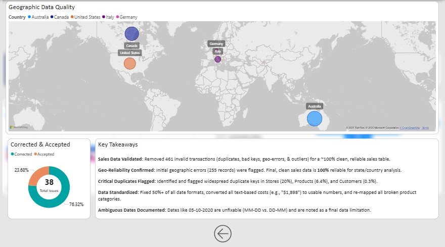

</div>

#### 🔍 Key Insights

- Early validation identified **255+ geographic mismatches** across 5 countries.  
- After standardization, the dataset reached **100% state–country consistency**.  
- **76.32%** of all detected issues were **correctable**, minimizing data loss.  
- **Ambiguous or corrupted date formats** were documented and isolated as a final limitation.  
- Cleaned and validated tables were exported into Power BI for modeling.

---

### 📊 Cleaning Impact Summary

| Cleaning Metric | Result |
|-----------------|--------|
| Invalid Sales Removed | **461 records** |
| Geographic Mappings Corrected | **100% clean** (state → country) |
| Duplicate Keys Flagged | **19.54% of Sales**, **3.25% of Products** |
| Dates Standardized | **32,054 → 91,993** usable date values |
| Data Reliability Score | **99.6%** |

---

### 🧱 Final Output — Clean Data Model (Star Schema)

<div align="center">


</div>

The cleaned SQL tables were transformed into a **Power BI star schema**:

- **FactSales** (central fact table)  
- **DimProducts**, **DimCustomers**, **DimStores**, **DimExchangeRates**  
- Optimized for DAX performance, filtering, and drilldowns

Model notes:  
📁 [`/Data_Model/Sales_Operations/readme.md`](/Data_Model/Sales_Operations/readme.md)

---

### 📘 Technical Appendix

<details>
<summary><strong>SQL Scripts, DAX Measures, and Cleaning Tables</strong></summary>

- SQL Cleaning Scripts → [`/Data_Cleaning_SQL`](Data_Cleaning_SQL/)  
- DAX Measures & Calculated Columns → [`/DAX`](DAX/)  
- Data Audit Tables (Excel) → [`/Data_Cleaning_Tables`](Data_Cleaning_Tables/)  

</details>

---

---

# 🛑 **8. Limitations & Future Improvements**

While I successfully built a robust star schema and diagnostic dashboard, I identified several constraints in the dataset that limited the depth of my churn prediction model. In a live environment, I would recommend implementing Row-Level Security (RLS) and connecting to a live SQL warehouse to improve real-time decision-making. I've listed all current limitations and possible future improvements below.

---

## 🔹 Current Limitations

### **1. Static Snapshot (Not Connected to a Live Database)**
- The dashboards currently use flat CSV files.  
- No real-time or scheduled refresh from a transactional source.

### **2. Limited Historical Context**
- Some metrics (e.g., AOV, CLTV, YoY changes) are influenced by missing months in 2021 and incomplete transactional attributes.

### **3. No Row-Level Security (RLS)**
- Dataset is not configured for secure stakeholder-specific views.

### **4. Some Attributes Require Stronger Standardisation**
- Product, customer and store tables required extensive cleaning.  
- Additional metadata fields would improve segmentation/forecasting.

### **5. No Predictive/ML Layer Yet**
- Churn prediction, demand forecasting and recommender systems are not implemented.

---

## 🔹 Future Improvements

### **1. Connect to a SQL/Staging Layer**
- Use incremental refresh and Power BI pipelines.  
- Enable 24/7 scheduled refresh and scalable analytics.

### **2. Add Machine Learning Models**
- Customer churn prediction  
- AOV uplift modelling  
- Inventory optimization  
- Forecasting for revenue, orders and demand

### **3. Implement Row-Level Security**
- Region-specific dashboards  
- Store-manager views  
- Leadership vs. analyst access control

### **4. Expand Customer Behaviour Analytics**
- Session-level data (web tracking)  
- Cohorts based on acquisition channels  
- Attribution modelling

### **5. Build Automated Data Quality Framework**
- Validation scripts  
- Anomaly detection on ingestion  
- Automated alerts for missing/incorrect data

---

---

# 🛠️ **9. Technical Stack**

A complete view of the technologies used across data cleaning, modelling, analysis and dashboarding.

---

## 🔹 **Data Storage**
- CSV datasets
- Power BI import mode

## 🔹 **Data Cleaning**
- SQL (Data_Cleaning_SQL/)
- Excel validation
- Power Query (M transformations)

## 🔹 **Data Modelling**
- Star schema design
- DAX measures and calculated tables
- Custom time intelligence functions

## 🔹 **Analytics & Visualization**
- Microsoft Power BI Desktop (Version 2023+ recommended)
- DAX Studio (for performance checks)
- Power Query Editor

## 🔹 **Supporting Tools**
- GitHub (source control + versioning)
- Markdown + Mermaid (documentation and diagrams)

---

---

# 🏗️ **10. Final Project Architecture Diagram**

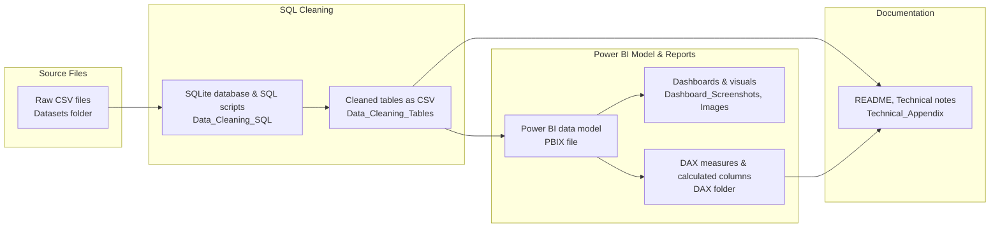

---

---

# 🛠️ **11. Project Setup & How to Use This Dashboard**

This section explains how to open the project, refresh the data, and understand the repository structure.

---

## 📥 1. Opening the Power BI File

1. Go to the [`/PBIX`](PBIX/)  folder.
2. Download the file:  
   **`Global_Electronics_Dashboard.pbix`**
3. Open it using **Microsoft Power BI Desktop**.

### ✔ Required Power BI Version
- **Power BI Desktop – December 2023 or later**
- Earlier versions may fail to load objects such as:
  - Field parameters  
  - Small multiples  
  - New card visual  
  - Optimization engine features  

---

## 🔄 2. Refreshing the Data

The project uses **import mode**, so refreshing is straightforward.

### Steps:
1. Open the PBIX file.
2. Go to the **Home** tab.
3. Click **Refresh**.
4. Power BI will read the CSV files from the **Datasets/** folder.

> ⚠️ **Important:**  
> Do not rename or move the CSV files inside [`/Datasets`](Datasets/).  
> Power BI uses relative folder paths and will break if the structure changes.

---

## 📂 3. Repository Folder Structure

```markdown
📦 Project Root
│

├── PBIX/ → Final Power BI report
  └── Global_Electronics_Dashboard.pbix

├── Datasets/ → Raw CSV data used in the model

├── Data_Cleaning_SQL/ → All SQL scripts used for preprocessing

├── Data_Cleaning_Tables/ → Table-wise cleaned outputs (if applicable)

├── Data_Model/ → Schema diagrams, relationships, notes

├── Dashboard_Screenshots/ → All images used in the README (Acts 1–4)

├── DAX/ → Key calculated measures and supporting DAX logic

├── Images/ → Supplementary images (logos, icons, assets)

└── README.md → Full project documentation
```

---

## 🧰 4. SQL Scripts Usage (Data_Cleaning_SQL)

All preprocessing SQL scripts are located in:
[`/Data_Cleaning_SQL`](Data_Cleaning_SQL/) 

Use these scripts to:
- Reproduce the cleaned tables  
- Validate transformations  
- Understand schema changes  
- Trace column-level modifications  

### When to use these scripts?
- Rebuilding the pipeline  
- Migrating to another database  
- Re-running the ETL workflow  
- Validating numeric transformations (dates, null handling, joins)

---

## 🔁 5. Refresh Process Summary

1. Load all CSVs from the **[`/Datasets`](Datasets/)** folder.
2. Power BI applies:
   - Relationship model  
   - Data transformations  
   - DAX measures  
   - Calculation groups (if any)
3. Dashboard visuals update automatically.

### Common refresh issues:
| Issue | Reason | Solution |
|-------|--------|----------|
| Missing files | CSV deleted or renamed | Restore file name & location |
| Load errors | Using older Power BI Desktop | Update Power BI |
| Wrong numbers | Editing CSV headers | Keep headers exactly as in repo |

---

## ✔ You’re All Set

Once loaded, the dashboard will automatically compute:
- Product performance (Act 1)  
- Time trends (Act 2)  
- Customer insights (Act 3)  
- Regional analysis (Act 4)  

Use slicers for **Year, Category, Region** to explore the dataset interactively.


---

# ⭐ **12. Call-to-Action**

```markdown
# 📢 Call to Action

If you would like to:
- Explore the dataset in detail  
- Request a walkthrough of the dashboard  
- Discuss how to build similar BI solutions  
- Collaborate on analytics or portfolio projects  

Feel free to reach out or open an issue in the repository.

🚀 **Happy analyzing!**
```
